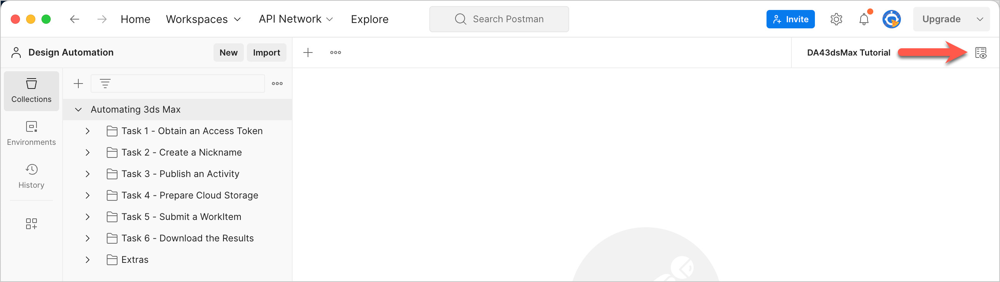
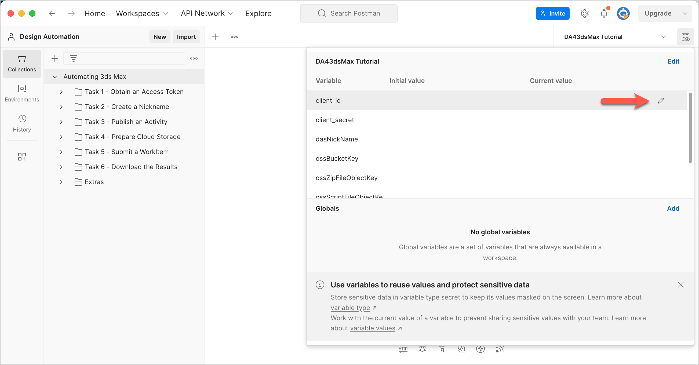
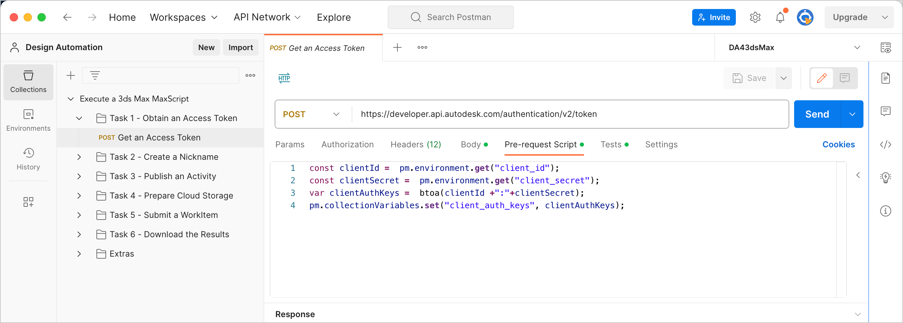
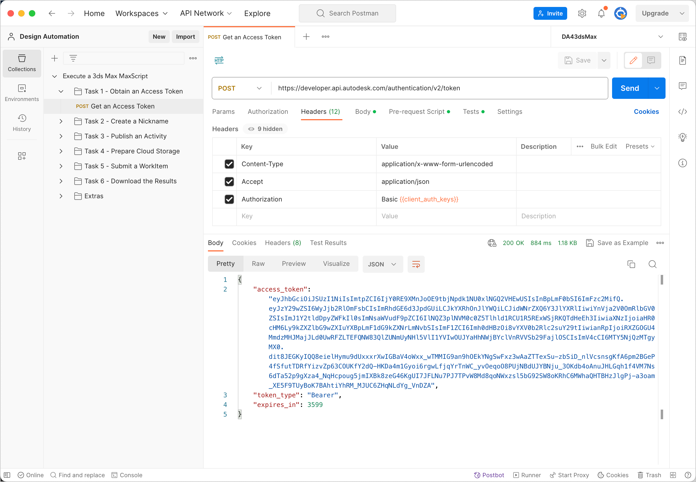

# Task 1 - Obtain an Access Token

## Create an App

1. Follow the instructions on the tutorial [Create an App](https://aps.autodesk.com/en/docs/oauth/v2/tutorials/create-app/).
 When specifying details of the app,  select "Design Automation API" and "Data Management API".

2. Note down the *Client ID* and *Client Secret* of the app you created. You will need this in the next step.

## Save Client ID and Client Secret to Postman Environment Variables

In the DA43dsMax Tutorial environment that you selected earlier, there are two Postman Environment Variables named `client_id` and `client_secret`. By setting these variables, you don't need to specify their values when you send HTTP requests to APS.

To set the environment variables:

1. Click the **Environment quick look** icon on the upper right corner of Postman.

   

2. Click in the **CURRENT VALUE** column on the **client_id** row. The Edit icon displays.

    

3. Click the Edit icon, and enter the *Client ID* you jotted down earlier.

4. Similarly, enter the *Client Secret* you jotted down earlier, in the **CURRENT VALUE** column on the **client_secret** row.

5. Click the **Environment quick look** icon again to close it.

## Get an Access Token

To get an Access Token, you must send an `authenticate` request to APS. The Postman collection has a pre-populated authenticate request that you can send. To send the request to APS:

1. On the Postman sidebar, click **Task 1 - Obtain an Access Token > POST Get an Access Token**. The request loads.

2. Click the **Pre-request Script** tab. Notice how a script (written in JavaScript) takes the Client ID and Client Secret, concatenates them, converts to a Base64 encoded string, and saves it back to a Postman Collection Variable named `client_auth_keys`.

   

3. Click the **Headers** tab. Take note of how `client_auth_keys` is used in the request header.

4. Click the **Body** tab. Take note of how the required scopes are specified.  

5. Click **Send**. The request is sent to APS. If your request authenticates successfully, you should see a response similar to the following:

    

Postman saves the Access Token in the Postman environment variable `dasApiToken`. Postman will pick up the Access Token from this variable for all subsequent requests, eliminating the need for you to repeatedly specify the value of the token. The token remains valid for one hour.  If the token expires, you must obtain a fresh token by sending an `authenticate` request to APS once again.

[:rewind:](../readme.md "readme.md") [:arrow_backward:](before_you_begin.md "Previous task") [:arrow_forward:](task-2.md "Next task")
