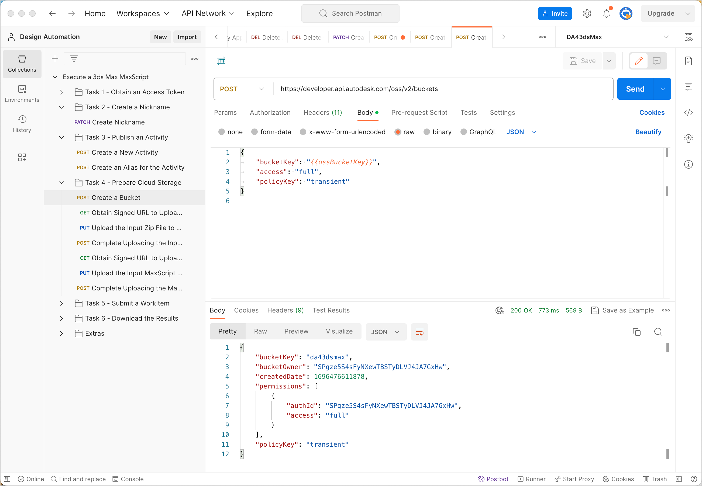
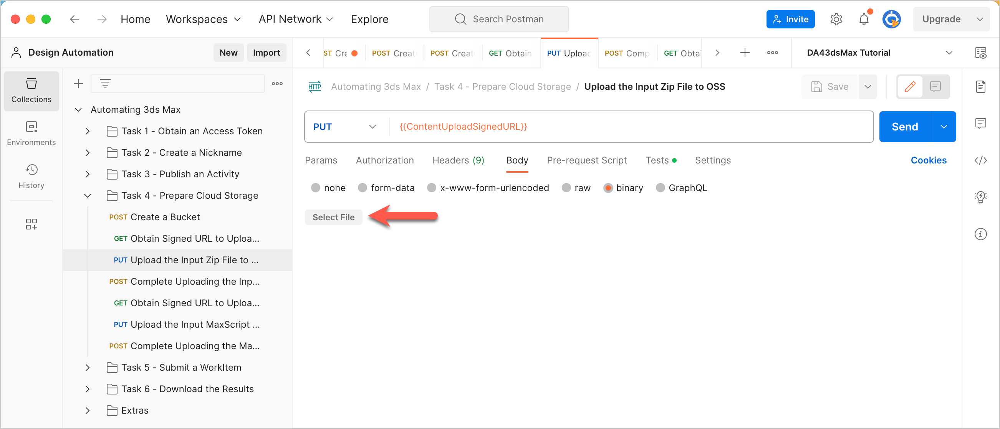
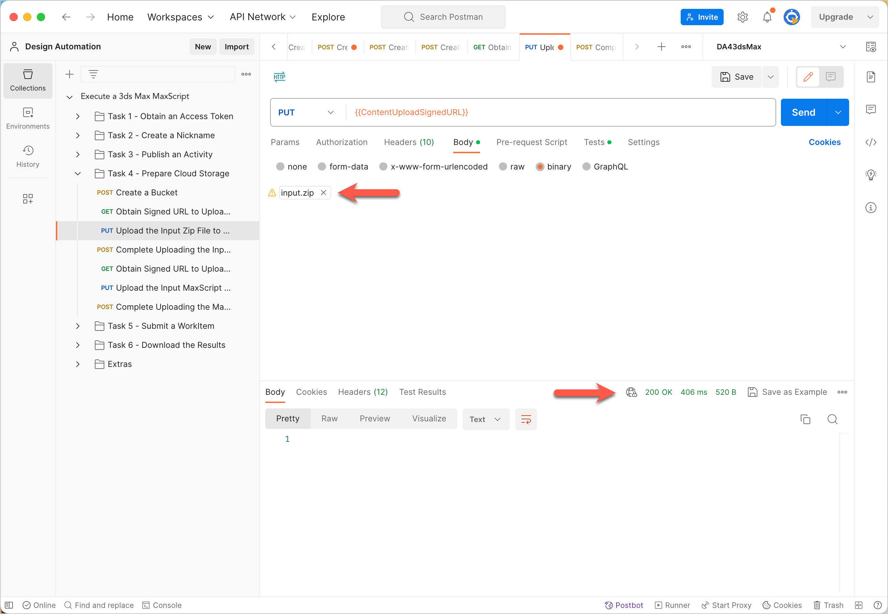
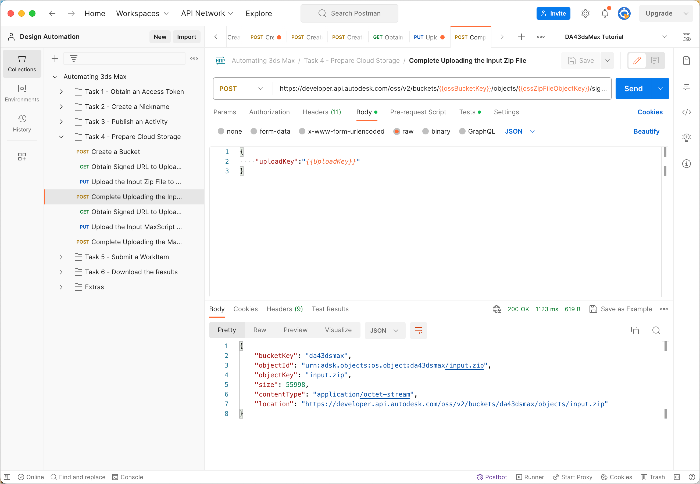

# Task 4 - Prepare cloud storage

When Design Automation executes the Activity you created in Task 3, it must access the 3ds Max scene file to process and the MAXScript file to run. Design Automation also needs to upload the output of the Activity. You can use any cloud storage service for this purpose. However, in this task, you will use the Data Management API to access the *Object Storage Service* (*OSS*).

## Create a Bucket

In this tutorial, you will use a Postman environment variable named `ossBucketKey` to hold the Object Key of the Bucket that contains your files in the cloud.

1. Specify a value for the Bucket Key in the Postman Environment Variable named `ossBucketKey`:

    1. Click the **Environment quick look** icon (the eye icon) on the upper right corner of Postman.

    2. In the **CURRENT VALUE** column, in the **ossBucketKey** row, specify a name for the Bucket that stores your files.

        **Notes:**  
        - The Bucket name needs to be unique throughout the OSS service. if a Bucket with the name you specified already exists, the system will return a `409` conflict error in step 5. If you receive this error, change the value of this variable and try again.

        - The Bucket name must consist of only lower-case characters, numbers 0-9, and the underscore (_) character.

    3. Click the **Environment quick look** icon to hide the variables.

4. In the Postman sidebar, click **Task 4 - Prepare Cloud Storage > POST Create Bucket**. The request loads.

5. Click the **Body** tab, and verify that the `bucketkey` attribute has been set to the variable `ossBucketKey`.

5. Click **Send**. If the request is successful, you should see a screen similar to the following image.

    

## Obtain Signed URL to upload 3ds Max scene file to OSS

1. Download the zip file containing the 3ds Max scene file *input.zip* from the [*tutorial_data* folder of this repository](../tutorial_data).

2. Click the **Environment quick look** icon on the upper right corner of Postman.

3. In the **CURRENT VALUE** column, in the **ossZipFileObjectKey** row, specify an Object Key for the file you are going to upload (**Tip:** You can specify the file name of the file you will upload as the Object Key, which is *input.zip*).

4. Click the **Environment quick look** icon to hide the variables.

5. On the Postman sidebar, click **Task 5 - Prepare Cloud Storage > GET Obtain Signed URL to Upload the Input Zip File**. The request loads.

6. Click **Send**. The signed URL is saved to a Collection Variable named `ContentUploadSignedURL`. The Upload Key is also saved to a variable named `UploadKey`. The Upload Key uniquely identifies the upload session. You use it later to complete the upload session.

## Upload 3ds Max scene file to OSS

1. In the Postman sidebar, click **Task 4 - Prepare Cloud Storage > PUT Upload Input ZIP File TO OSS**. The request loads.

3. Click the **Body** tab.

4. Click **Select File** and select the zip file you downloaded earlier.

    

5. Click **Send**. If your request is successful, you should see a screen similar to the following image:

    

## Complete the upload operation

To make the uploaded file available for download, you must specifically instruct OSS that the upload process has been completed.

1. On the Postman sidebar, click **Task 5 - Prepare Cloud Storage > POST Complete Uploading the Input Zip File**. The request loads.

2. Click the **Body** tab and pay attention to how the Upload Key tells OSS what upload session to close.

2. Click **Send**. If your request is successful, you should see a screen similar to the one below:

    

## Obtain Signed URL to Upload MAXScript file to OSS

1. Download the file *Twistit.ms*, containing the 3ds Max scene file, from the [*tutorial_data* folder of this repository](../tutorial_data).

2. Click the **Environment quick look** icon on the upper right corner of Postman.

3. In the **CURRENT VALUE** column, in the **ossScriptFileObjectKey** row, specify an Object Key for the file you are going to upload (**Tip:** Specify the file name of the dwg file: *Twistit.ms*).

4. Click the **Environment quick look** icon to hide the variables.

5. On the Postman sidebar, click **Task 5 - Prepare Cloud Storage > GET Obtain Signed URL to Upload the Input File**. The request loads.

6. Click **Send**. The signed URL is saved to a Collection Variable named `ContentUploadSignedURL`. The Upload Key is also saved to a variable named `UploadKey`. The Upload Key uniquely identifies the upload session. You use it later to complete the upload session.

## Upload MAXScript file to OSS

1. In the Postman sidebar, click **Task 4 - Prepare Cloud Storage > PUT Upload Input MAXScript File to OSS**. The request loads.

3. Click the **Body** tab.

4. Click **Select File** and select the MAXScript file you downloaded earlier.

5. Click **Send**. If the request is successful, the response status should be `200 OK`.

## Complete the upload operation

To make the uploaded file available for download, you must specifically instruct OSS that the upload process has been completed.

1. On the Postman sidebar, click **Task 5 - Prepare Cloud Storage > POST Complete Uploading the MaxScript File**. The request loads.

2. Click the **Body** tab and pay attention to how the Upload Key tells OSS what upload session to close.

3. Click **Send**.

## Define Object Key for the file generated by the activity.

The Activity you defined in Task 3 generates a zip file containing a *.png* file and a scene file. You must specify an Object Key for the zip file so that Design Automation is save it to OSS. Use the Postman Environment Variables  `ossOutputFileObjectKey` to hold the Object Key.

1. Click the **Environment quick look** icon on the upper right corner of Postman.

2. In the **CURRENT VALUE** column, in the **ossOutputFileObjectKey** row, specify an Object Key for the text file that `ListLayersActivity` generates.

   **Tip:** You can use the name you specified for the `OutputZip`, when you defined the Activity in Task 3 (*workingFolder.zip*).

[:rewind:](../readme.md "readme.md") [:arrow_backward:](task-3.md "Previous task") [:arrow_forward:](task-5.md "Next task")
