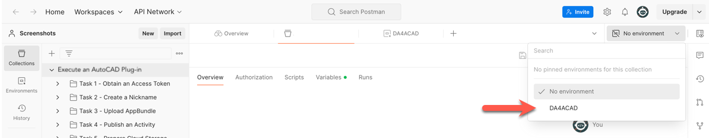

# Before you begin...

## Import the Postman Collection and Postman environment.

Postman Collections are groups of prepopulated HTTP requests. They can also contain scripts that are executed when you send an HTTP request, and/or receive a response.

Postman environments are named configurations that implement environment variables to store values you typically use across many HTTP requests. For example, this Postman Collection stores the Access Token, which is used across most HTTP requests, in a variable named `dasApiToken`.

To import the Postman Collection and environment you need for this tutorial:

1. Download the following zip file from the [*collections* folder](../collections) and expand it on your local machine.

    - _acad_collections.zip_

2. In the Postman header bar, click **Import**. A dialog displays.

3. Drag the files you expanded in step 1 to the area marked **Drop files here**. Alternatively, you can click **Choose Files** and pick the files you expanded in step 1.

4. Click the **Environment drop-down** on the upper-right, and select **DA4ACAD Tutorial**. The environment loads.
   

[:rewind:](../readme.md "readme.md")  [:arrow_forward:](task-1.md "Next task")
