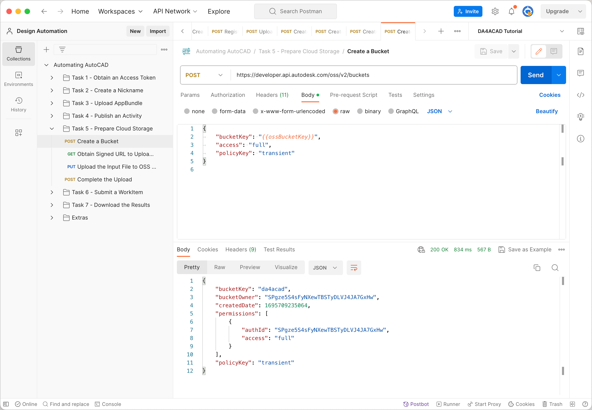
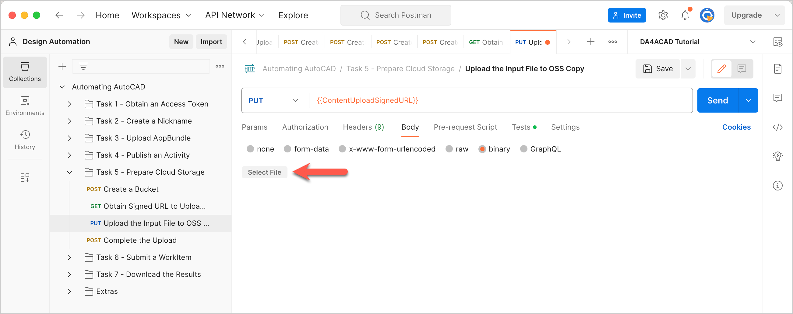
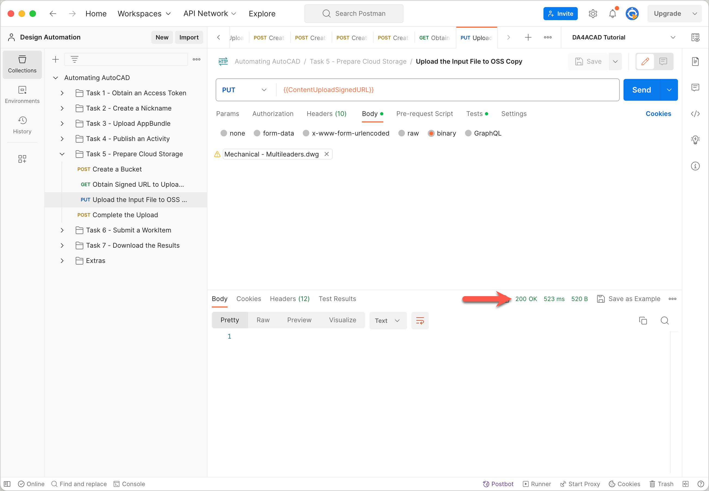
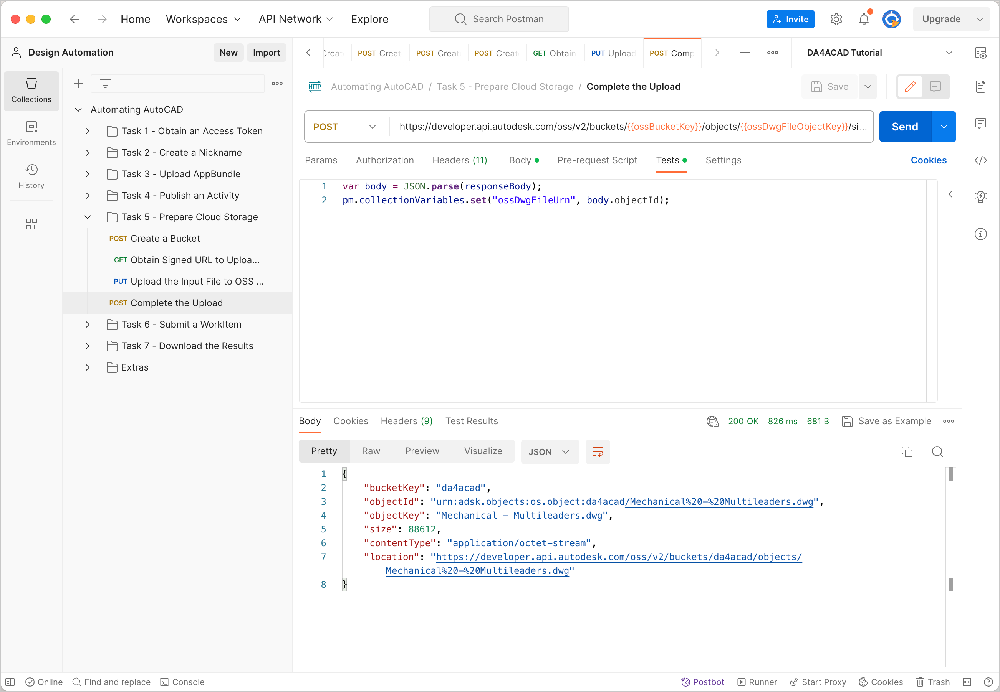

# Task 5 - Prepare Cloud Storage

The Activity `ListLayersActivity` takes a dwg file as an input, extracts layer names from it, and produces a text file containing the layer names as output. In this task, we prepare the cloud storage to hold these files. While you can use any cloud storage service for this purpose, this walkthrough uses the Object Storage Service (OSS) through the Data Management API.

There are two Postman Environment Variables you must specify for this task. They are
- `ossBucketKey` - The Bucket Key for the Bucket that holds your files in the cloud.
- `ossDwgFileObjectKey` - An ID for the dwg file that the activity must run operate on.

## Create a Bucket

1. Click the **Environment quick look** icon on the upper right corner of Postman.

2. In the **CURRENT VALUE** column, in the **ossBucketKey** row, specify a name the Bucket that stores your files.

    **Notes:**  
    - The Bucket name needs to be unique throughout the OSS service. if a Bucket with the name you specified already exists, the system will return a `409` conflict error in step 5. If you receive this error, change the value of this variable and try again.

    - The Bucket name must consist of only lower case characters, the numbers 0-9, and the underscore (_) character.

3. Click the **Environment quick look** icon to hide the variables.

4. On the Postman sidebar, click **Task 5 - Prepare Cloud Storage > POST Create a Bucket**. The request loads.

5. Click **Send**. If the request is successful, you should see a screen similar to the following image.

    

## Obtain Signed URL to upload the Input File

1. Download the input file, *Mechanical - Multileaders.dwg* from the [*walkthrough_data* folder of this repository](../walkthrough_data).

2. Click the **Environment quick look** icon on the upper right corner of Postman.

3. In the **CURRENT VALUE** column, in the **ossDwgFileObjectKey** row, specify an Object Key for the file you are going to upload (**Tip:** Specify the file name of the dwg file: *Mechanical - Multileaders.dwg*).

4. Click the **Environment quick look** icon to hide the variables.

5. On the Postman sidebar, click **Task 5 - Prepare Cloud Storage > GET Obtain Signed URL to Upload the Input File**. The request loads.

6. Click **Send**. The signed URL is saved to a Collection Variable named `ContentUploadSignedURL`. The Upload Key is also saved to a variable named `UploadKey`. The Upload Key uniquely identifies the upload session. You use it later to complete the upload session.

## Upload input file to OSS

1. On the Postman sidebar, click **Task 5 - Prepare Cloud Storage > PUT Upload Input File to OSS**. The request loads.

2. Click the **Body** tab.

3. Click **Select File** and pick the file you downloaded earlier (*Mechanical - Multileaders.dwg*).

    

4. Click **Send**. If your request is successful, you should see a screen similar to the one below:

    

## Complete the upload

To make the uploaded file available for download, you must specifically instruct OSS that the upload process has been completed.

1. On the Postman sidebar, click **Task 5 - Prepare Cloud Storage > POST Complete the upload**. The request loads.

2. Click the **Body** tab and pay attention to how the Upload Key tells OSS what upload session to close.

2. Click **Send**. If your request is successful, you should see a screen similar to the one below:

    

## Define Object Key for the resulting text file generated by the activity.

`ListLayersActivity` generates a text file containing layer names as an output. You must specify an Object Key for the text file so that Design Automation is save it to OSS. Use the Postman Environment Variables  `ossOutputFileObjectKey` to hold the Object Key.

1. Click the **Environment quick look** icon on the upper right corner of Postman.

2. In the **CURRENT VALUE** column, in the **ossOutputFileObjectKey** row, specify an Object Key for the text file that `ListLayersActivity` generates.

   **Tip:** You can use the file name of the text file (*layers.txt*) as its Object Key.

[:rewind:](../readme.md "readme.md") [:arrow_backward:](task-4.md "Previous task") [:arrow_forward:](task-6.md "Next task")
