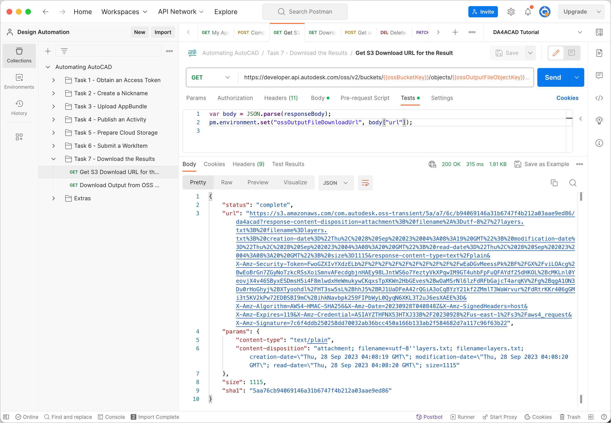
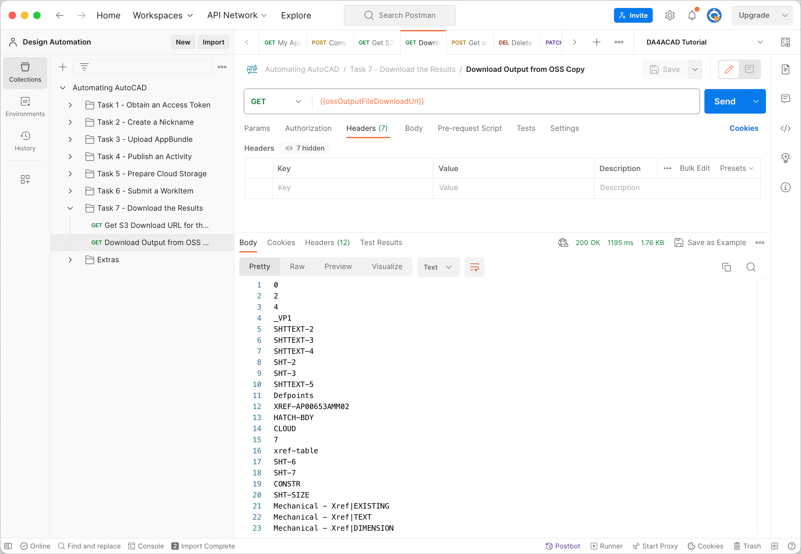
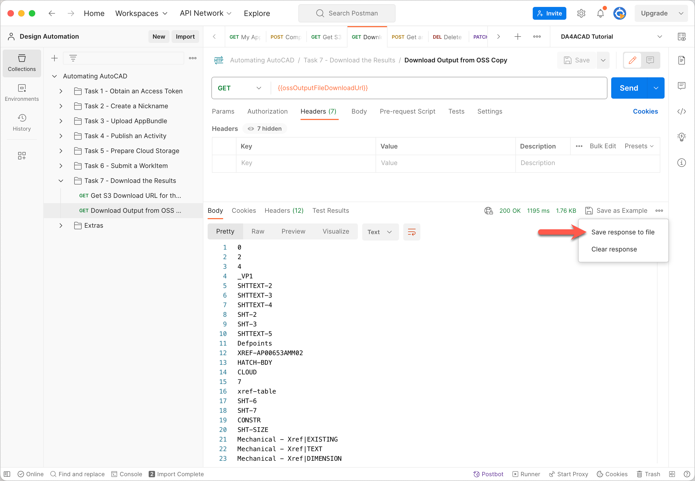

# Task 7 - Download the results

Once the WorkItem has completed executing the Activity, Design Automation uploads the resulting text file to OSS. You use the Data Management API to download the text file to your local machine.

## Get temporary download URL for the result

1. On the Postman sidebar, click **Task 7 - Download the Result > GET S3 Download URL for the result**. The request loads.

2. Click **Send**. You should see a screen similar to the following image.

    

## Download the output from OSS

1. On the Postman sidebar, click **Task 7 - Download the Result > GET Download Output from OSS**. The request loads.

2. Click **Send**. You should see a screen similar to the following image.

    

3. In the response area, click **Save response to a file**. The output file downloads. Save the file as a *.txt* file, when prompted to.

    

[:rewind:](../readme.md "readme.md") [:arrow_backward:](task-6.md "Previous task")
