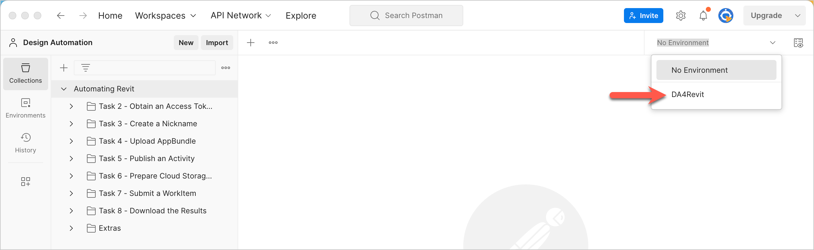

# Before you begin...

## 1. Import Postman Collections for the walkthrough

Postman Environments are named configurations that implement variables to store values you typically use across many HTTP requests. For example, APS's Base URL is stored in the environment variable `baseUrl`. To import the environment you need for this walkthrough:

1. Download the following two files from the [*collections* folder](../collections) to your local machine:

    - _DA4Fusion-Collection Tutorial.postman_collection.json_
    - _DA4Fusion-Environment.postman_environment.json_

2. In the Postman header bar, click **Import**. A dialog displays.

3. Drag the two files you downloaded in step 1 to the area marked **Drop files here**. Alternatively, you can click **Choose Files** and pick the two files you downloaded in step 1.

4. Click the **Environment drop-down** on the upper-right, and select **Execute a Fusion Script**. The environment loads.
   

[:rewind:](../readme.md "readme.md")  [:arrow_forward:](task-1.md "Next task")
