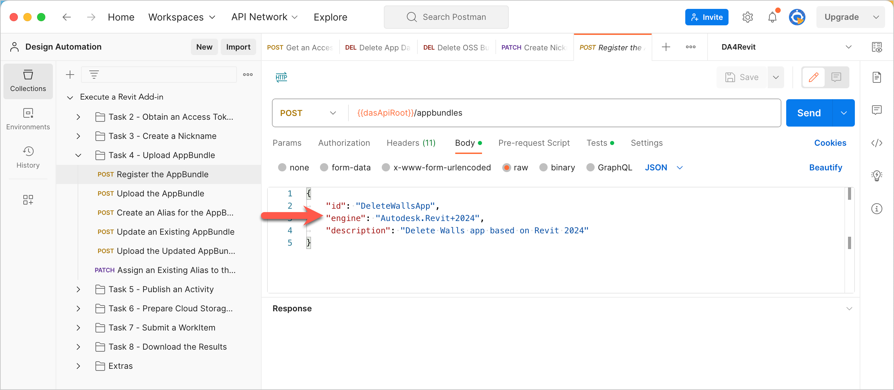
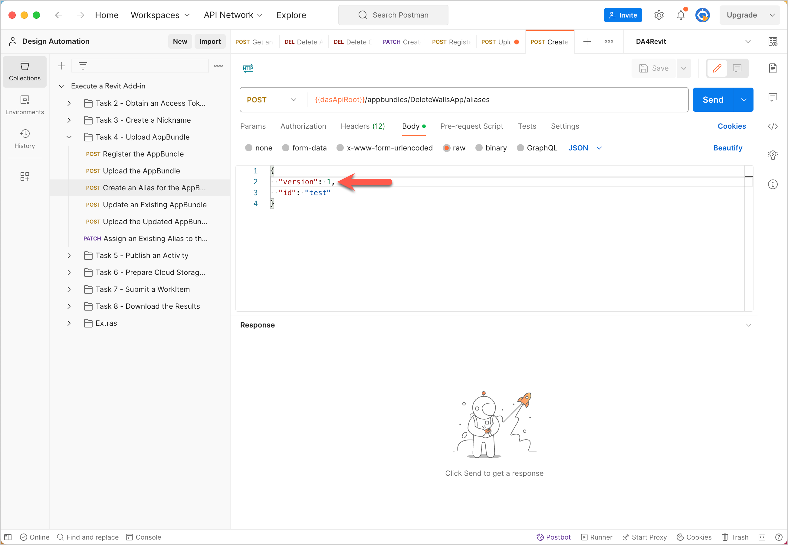
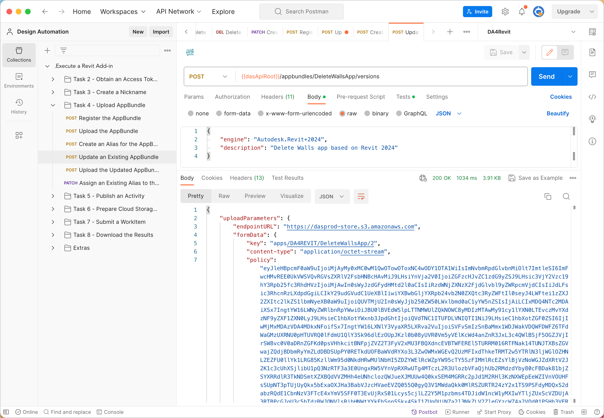

# Task 3 - Upload an AppBundle to Design Automation

An AppBundle is a package of binaries and supporting files that make up a Fusion add-in. See the corresponding [task in the How-to Guide on the APS developer portal](https://aps.autodesk.com/en/docs/design-automation/v3/tutorials/fusion/step4-publish-appbundle/) for an explanation of AppBundles and learn how to create an AppBundle. For the purpose of this Postman walkthrough,  download *CreateNutApp.zip*, which is stored in the [*walkthrough_data* folder of this repository](../walkthrough_data).

## Register the AppBundle

When registering the AppBundle, you inform Design Automation that you want to name it CreateNutApp, and that it must run on Fusion latest.

1. First Check in the DA4Fusion Environment that the `appBundleName` variable is set to `CreateNutApp` and the `engine` variable is set to `Autodesk.Fusion+Latest`
   
2. On the Postman sidebar, click **Task 3 - Upload AppBundle > POST Register the AppBundle**. The request loads.

3. Click the **Body** tab, and verify that the `id`, and `engine` are set to `{{appBundleName}}`, and `{{engine}}`.

    

4. Click **Send**. If the request is successful, you will see a screen similar to the following image:

    

    The `endpointURL` and `formData` information required to upload the AppBundle is saved to Postman Collection variables.

## Upload the AppBundle

1. On the Postman sidebar, click **Task 3 - Upload AppBundle > POST Upload the AppBundle**. The request loads.

2. Click the **Body** tab, and scroll down such that the **file** row is visible.

3. Move the cursor to the **VALUE** column on the **file** row.

4. Click **Select Files**, and pick *CreateNutApp.zip*, which you downloaded earlier.

    

5. Click **Send**. You should see a screen similar to the following. Note that the response has only a header and no body.

    

## Create an Alias for the AppBundle

When you registered the AppBundle earlier, it was registered as version 1 of the AppBundle. Now, you create an alias named test to reference that version.

1. On the Postman sidebar, click **Task 3 - Upload AppBundle > POST Create an Alias for the AppBundle**. The request loads.

2. Click the **Body** tab. and note how `id` is set to `{{CreateNutAppBundleVersion}}`. This is because in the earlier request we already extracted the version number for your convenience

    

3. Click **Send**. You should see a response similar to the following image.

    

## Update an existing AppBundle

To update an existing AppBundle, you must register a new version of the AppBundle and then upload the updated AppBundle for that version. If you try to overwrite an existing AppBundle, Design Automation returns a `409 Conflict` error.

To register a new version:

1. On the Postman sidebar, click **Extras > Update AppBundle > Register New AppBundle Version**. The request loads.

2. Click the **Body** tab. Note that you are now specifying only the engine and description.

3. Click **Send**. You should see a response similar to the following image. As with registering an AppBundle, the `endpointURL` and `formData` information required to upload the AppBundle is saved to Postman Collection variables.

    

## Upload the updated AppBundle

1. On the Postman sidebar, click **Extras > Update AppBundle > Upload New Appbundle**. The request loads.

2. Click the **Body** tab, and scroll down such that the **file** row is visible.

3. Click **Select Files**, and pick *CreateNutApp.zip*, which you downloaded earlier.

4. Click **Send**.

## Assign the Alias you specified earlier to the updated AppBundle

1. On the Postman sidebar, click **Extras > Update AppBundle > Patch Appbundle Alias**. The request loads.

2. Click the **Body** tab. Observe how the new version is specified.

3. Click **Send**.

[:rewind:](../readme.md "readme.md") [:arrow_backward:](task-2.md "Previous task") [:arrow_forward:](task-4.md "Next task")
