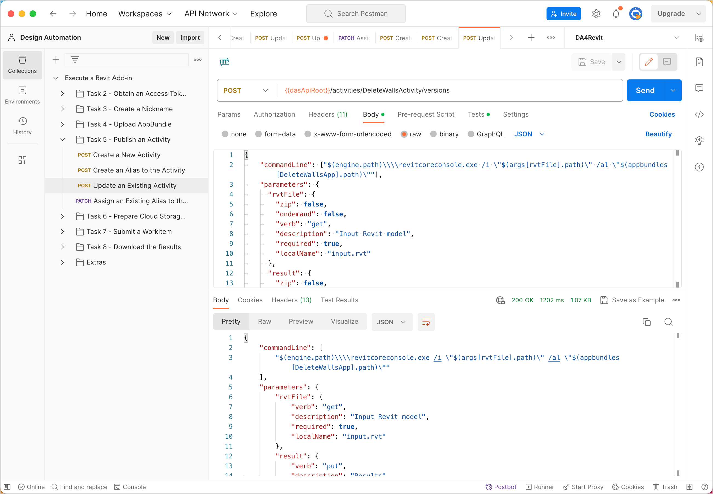
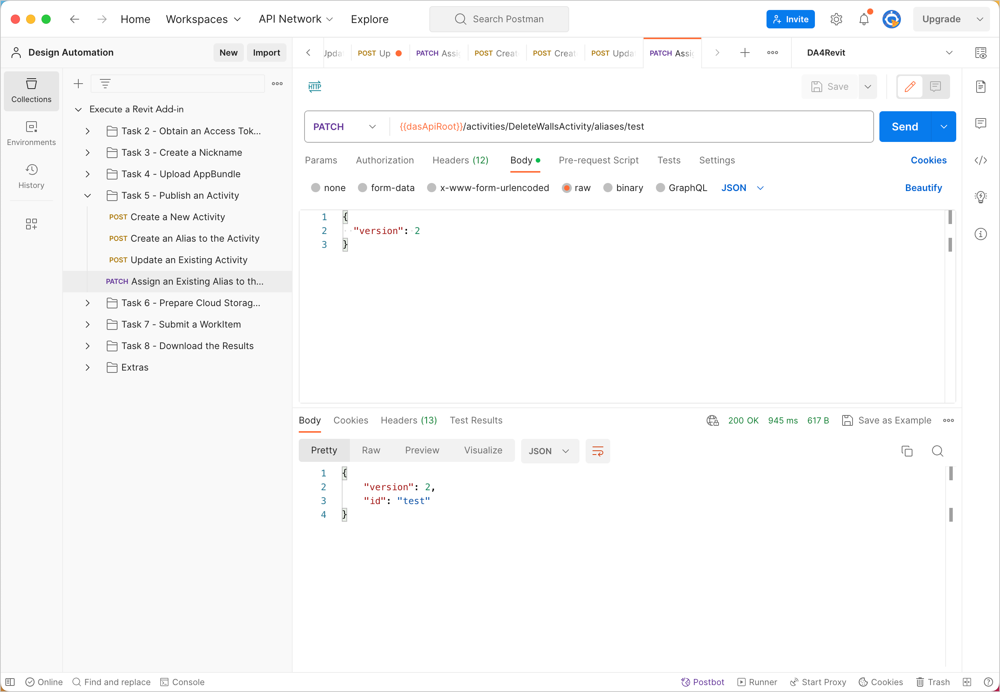

# Task 4 - Create an Activity

An Activity is an action that can be executed in Design Automation. You create and post Activities to run specific AppBundles.

## Create a New Activity

1. On the Postman sidebar, click **Task 4 - Create an Activity > POST Create a New Activity**. The request loads.

2. Click the **Body** tab. Observe the body parameters.

    

**Notes**
 - `id` is the name given to the new Activity.
 - `engine` is the Design Automation engine that the Activity (Fusion latest in this case) runs on.
 - `appbundles` is the fully qualified id of the AppBundle

1. Click **Send**. If the request is successful, you should see a screen similar to the following image.

    

## Create an Alias to the Activity

Design Automation does not let you reference an Activity by its `id`. You must always reference an Activity by an alias.  Note that an alias points to a specific version of an Activity and not the Activity itself.

To create an alias named `test`, which refers to version `1` of the `DeleteWallsActivity`:

1. On the Postman sidebar, click **Task 4 - Create an Activity > POST Create an Alias to the Activity**. The request loads.

2. Click **Send**. If the request is successful, you should see a screen similar to the following image.

    

## Update an Existing Activity

Design Automation does not let you overwrite an Activity once you have created it. If you want to modify/update an existing Activity,
you must update it as a new version. If you try to overwrite an existing Activity, Design Automation for Fusion throws a `409 Conflict` error.

To create a new version of an Activity:

1. On the Postman sidebar, click **Task 4 - Create an Activity > POST Update an Existing Activty**. The request loads.

2. Click the **Body** tab. Observe the body parameters.

3. Click **Send**. If the request is successful, you should see a screen similar to the following image.

    

## Assign an existing Alias to the updated Activity

Currently, the Alias `test` points to version `1` of the Activity. You send a PATCH request to assign this Alias to the new version of the Activity `DeleteWallsActivity`.

To send the PATCH request:

1. On the Postman sidebar, click **Task 4 - Create an Activity > PATCH Assign an Existing Alias to the Updated Activity**. The request loads.

2. Click **Send**. If the request is successful, you should see a screen similar to the following image.

    

[:rewind:](../readme.md "readme.md") [:arrow_backward:](task-4.md "Previous task") [:arrow_forward:](task-6.md "Next task")
