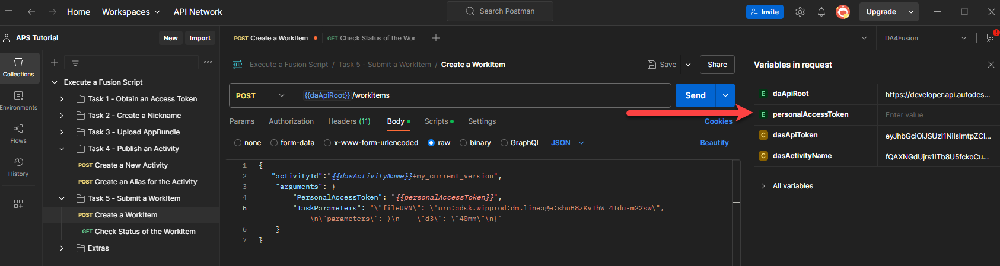
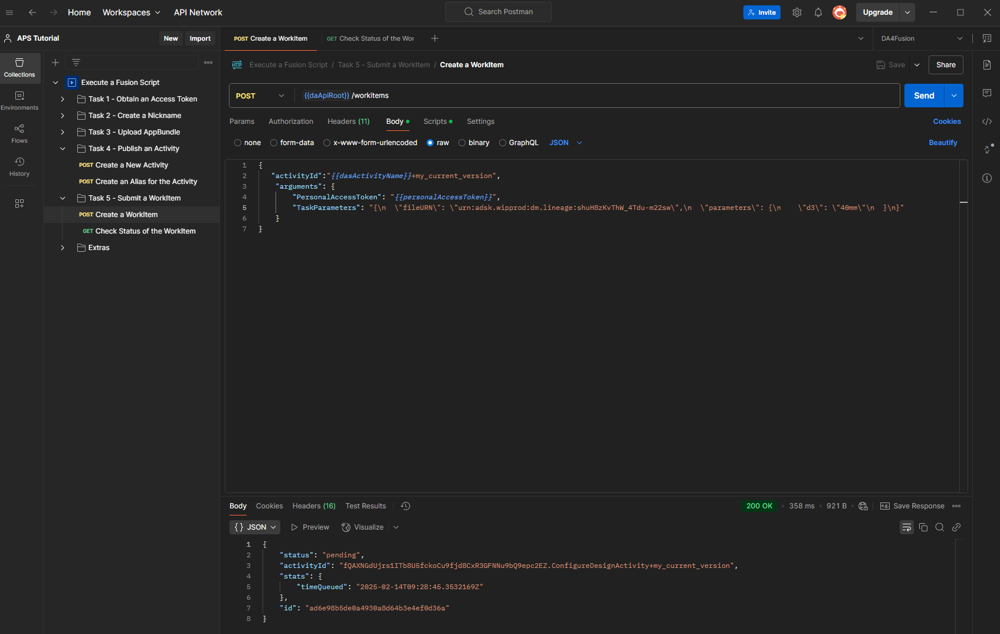
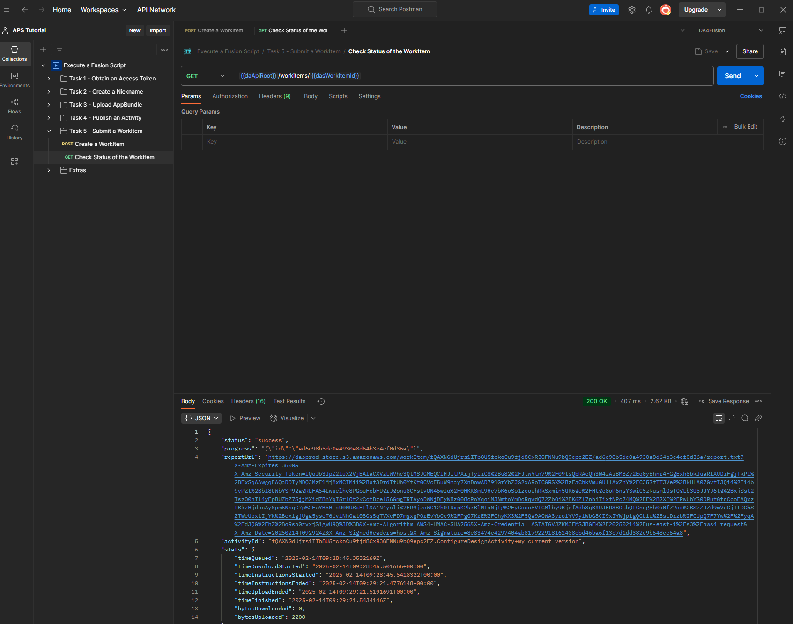

# Task 5 - Submit a WorkItem

When you submit a WorkItem to Design Automation, you are instructing Design Automation to execute the Activity specified in the WorkItem.

The relationship between an Activity and a WorkItem can be thought of as a “function definition” and “function call”, respectively.
Named parameters of the Activity have corresponding named arguments of the WorkItem.
Like in function calls, optional parameters of the Activity can be skipped and left unspecified while posting a WorkItem.

For this exercise, you will apply the ConfigureDesign Activity on a Fusion Design, out of the Fusion Team example files.

## Generate a Personal Access Token

To get a personal access token (PAT), simply access your autodesk profile via the following link: [Autodesk Security](https://profile.autodesk.com/security) and follow the instructions. Generate a PAT for product scope “Design Automation for Fusion” or “Project Alpine”. Either product scope will work.

The table below describes the different options for authentication and authorization for submitting WorkItems to DA4F.

| Option                                                        | OAuth Type | Required Body Content                   | Notes                                                                                    | Use Case                                                                                        |
|---------------------------------------------------------------|------------|-----------------------------------------|------------------------------------------------------------------------------------------|-------------------------------------------------------------------------------------------------|
| Submit for your activity on behalf of yourself as Fusion user | 2LO        | PAT of Fusion user                      | The owner of the app of the 2LO token must be same as the user that has created the PAT. | Access is needed for a "service user's" data that is aggregated from customers into one account |
| Submit for your activity on behalf of a different Fusion user | 3LO        | PAT of Fusion user + Signed Activity ID | 3LO token must be for the same user as the PAT                                           | Access is needed for direct customer data that logs in and allows it                            |

## Create a WorkItem

1. Click the **Environment quick look** icon on the upper right corner of Postman.

2. Click in the **CURRENT VALUE** column on the **personalAccessToken** row. The Edit icon displays.

    

3. Click the Edit icon, and enter the PAT you generated earlier.

4. On the Postman sidebar, click **Task 5 - Submit a WorkItem > Create a WorkItem**. The request loads.

5. Click the **Body** tab and observe how the Actvity ID, the input file, and the output file are specified.

6. Click **Send**. If the request is successful you should see a screen similar to the following image.

    

    The main attributes on the JSON payload are:

    - `activityId` - Specifies what Activity to execute. The id you specify here must be a fully qualified id. A fully qualified id is made up of three parts. They start with the Nickname of the app (or the Client Id of the app. The Nickname is followed by the '.' character, which in turn is followed by the Activity name. This is followed by the '+' character and finally the Activity Alias. For more information on fully qualified ids and unqualified ids, see the [documentation on ids](https://aps.autodesk.com/en/docs/design-automation/v3/developers_guide/aliases-and-ids/#ids).

    - `arguments` - Contains all the parameters that need to be passed to the Activity specified by `activityId`. They must match the parameters you specified in Task 5, when you created the Activity. In this case we send over the PAT so DA4Fusion can access files on Fusion teams, aswell as `"d3": "40mm"` as in a map of parameters to change the height of the nut to 40mm, additonal to the `fileurn` of the design we want to change.

## Check Status of a WorkItem

Design Automation WorkItems are queued before they are processed. Processing itself can take time. Once processing is done, you need to know if the WorkItems ran successfully or not. As such it is important for you to check the status of the WorkItem you created.

1. On the Postman sidebar, click **Task 5 - Submit a WorkItem > Check Status of a WorkItem**. The request loads.

2. Click **Send**. You should see a screen similar to the following image.

    

[:rewind:](../readme.md "readme.md") [:arrow_backward:](task-4.md "Previous task") [:arrow_forward:](task-6.md "Next task")
