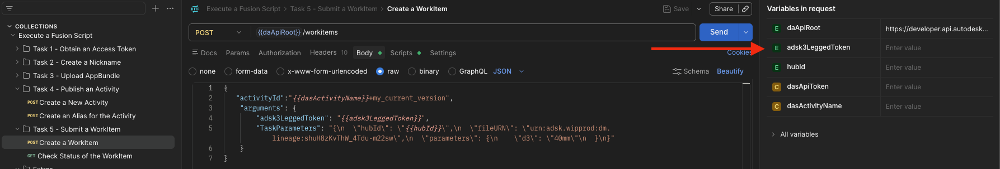
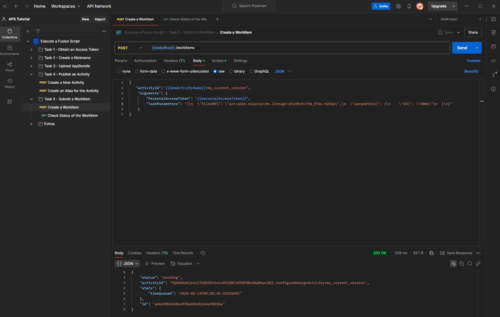
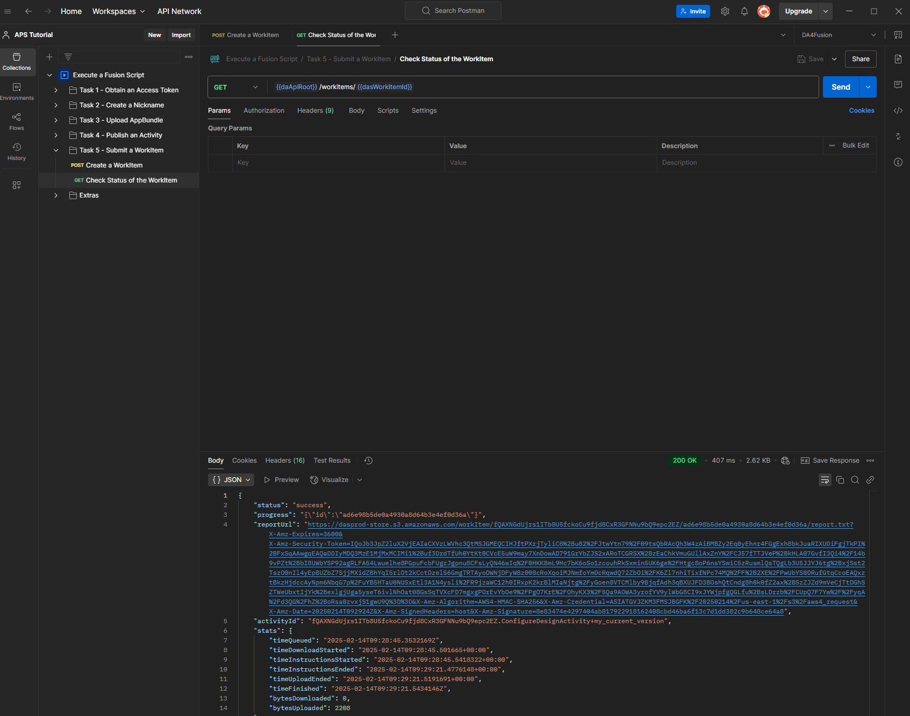

# Task 5 - Submit a WorkItem

When you submit a WorkItem to Design Automation, you are instructing Design Automation to execute the Activity specified in the WorkItem.

The relationship between an Activity and a WorkItem can be thought of as a “function definition” and “function call”, respectively.
Named parameters of the Activity have corresponding named arguments of the WorkItem.
Like in function calls, optional parameters of the Activity can be skipped and left unspecified while posting a WorkItem.

For this exercise, you will apply the ConfigureDesign Activity on a Fusion Design, out of the Fusion Team example files.

## Get a 3LO Token

The WorkItem accesses your Fusion Team data on behalf of a signed-in Fusion user. To identify that user, you supply a 3-legged OAuth (3LO) token in the body of the WorkItem. The 3LO token must include the following scopes:

- `data:read`
- `data:write`
- `data:create`
- `data:search`
- `account:read`
- `profapi:core-all-profile:read`
- `openid`

This collection includes a 3-legged OAuth helper so you can obtain the token directly in Postman:

1. Make sure `client_id` and `client_secret` are set in the environment (from [Task 2](task-2.md)). The `daAuthUrl` variable is already set to the authorization endpoint.

2. Select the **DA4Fusion** collection in the sidebar and open the **Authorization** tab. The type is set to **OAuth 2.0** with the scopes listed above.

3. Click **Get New Access Token**, sign in with the Autodesk account whose Fusion Team data you want to access, and approve the requested scopes.

4. Click **Use Token**, then copy the token value so you can paste it into the `adsk3LeggedToken` environment variable in the next step.

Alternatively, you can obtain a 3LO token by following the [Get a 3-Legged Token](https://aps.autodesk.com/en/docs/oauth/v2/tutorials/get-3-legged-token/) tutorial in the APS Authentication documentation.

The table below describes the different options for authentication and authorization for submitting WorkItems to DA4F. This tutorial uses the second option — a 2-legged token submits the WorkItem while a 3LO token in the body identifies the Fusion user.

| Option                                                        | OAuth Type | Required Body Content                   | Notes                                                                                    | Use Case                                                                                        |
|---------------------------------------------------------------|------------|-----------------------------------------|------------------------------------------------------------------------------------------|-------------------------------------------------------------------------------------------------|
| Submit for your activity on behalf of yourself as Fusion user | 2LO        | PAT of Fusion user                      | The owner of the app of the 2LO token must be same as the user that has created the PAT. | Access is needed for a "service user's" data that is aggregated from customers into one account |
| Submit for your activity using a 3LO token in the body        | 2LO        | 3LO token of Fusion user                | The 3LO token in the body identifies the user; the 2LO token authenticates the caller.   | For apps that authenticate to APIs with 2LO but need to access a Fusion user's data via 3LO.    |
| Submit for your activity on behalf of a different Fusion user | 3LO        | PAT of Fusion user + Signed Activity ID | 3LO token must be for the same user as the PAT                                           | Access is needed for direct customer data that logs in and allows it                            |
| Submit for your activity on behalf of a Fusion user (OBO)     | 3LO        | Signed Activity ID                      | The 3LO token carries the user identity, so no PAT is needed in the WorkItem body.       | Access is needed for direct customer data; preferred over passing a PAT alongside a 3LO token.  |

## Create a WorkItem

1. Click the **Environment quick look** icon on the upper right corner of Postman.

2. Click in the **CURRENT VALUE** column on the **adsk3LeggedToken** row. The Edit icon displays.

    

3. Click the Edit icon, and enter the 3LO token you obtained earlier.

4. In the same way, set the **hubId** variable to the id of the Fusion Team hub that contains your design. The script uses this value to set the active hub before opening the file, so it must match the hub the 3LO user has access to. (If you leave it empty, the script falls back to the user's default active hub.)

5. On the Postman sidebar, click **Task 5 - Submit a WorkItem > Create a WorkItem**. The request loads.

6. Click the **Body** tab and observe how the Actvity ID, the input file, and the output file are specified.

7. Click **Send**. If the request is successful you should see a screen similar to the following image.

    

    The main attributes on the JSON payload are:

    - `activityId` - Specifies what Activity to execute. The id you specify here must be a fully qualified id. A fully qualified id is made up of three parts. They start with the Nickname of the app (or the Client Id of the app. The Nickname is followed by the '.' character, which in turn is followed by the Activity name. This is followed by the '+' character and finally the Activity Alias. For more information on fully qualified ids and unqualified ids, see the [documentation on ids](https://aps.autodesk.com/en/docs/design-automation/v3/developers_guide/aliases-and-ids/#ids).

    - `arguments` - Contains all the parameters that need to be passed to the Activity specified by `activityId`. They must match the parameters you specified in Task 5, when you created the Activity. In this case we send over the 3LO token in the `adsk3LeggedToken` argument so DA4Fusion can access files on Fusion Team on behalf of the signed-in user. The `TaskParameters` argument carries the script inputs: the `hubId` of the Fusion Team hub to use, the `fileURN` of the design we want to change, and `"d3": "40mm"` as a map of parameters to change the height of the nut to 40mm.

## Check Status of a WorkItem

Design Automation WorkItems are queued before they are processed. Processing itself can take time. Once processing is done, you need to know if the WorkItems ran successfully or not. As such it is important for you to check the status of the WorkItem you created.

1. On the Postman sidebar, click **Task 5 - Submit a WorkItem > Check Status of a WorkItem**. The request loads.

2. Click **Send**. You should see a screen similar to the following image.

    

[:rewind:](../readme.md "readme.md") [:arrow_backward:](task-4.md "Previous task") [:arrow_forward:](task-6.md "Next task")
