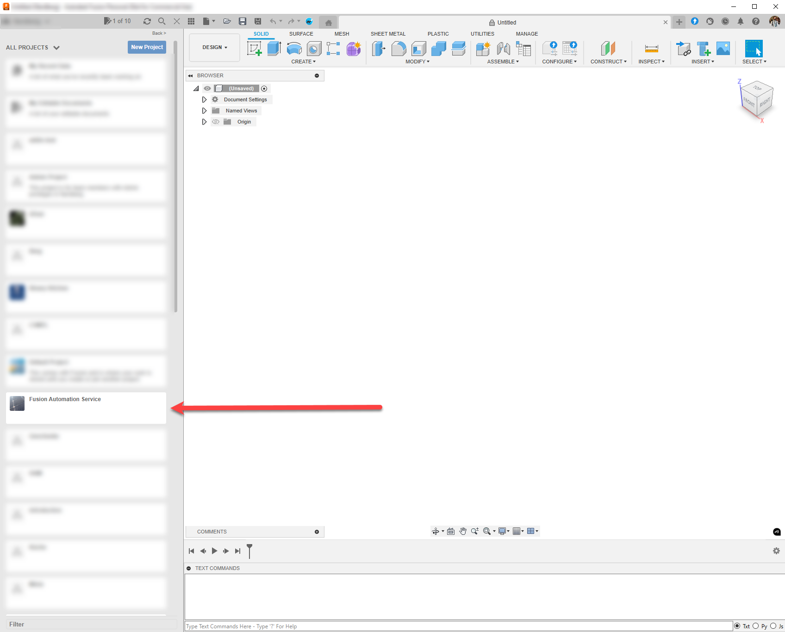
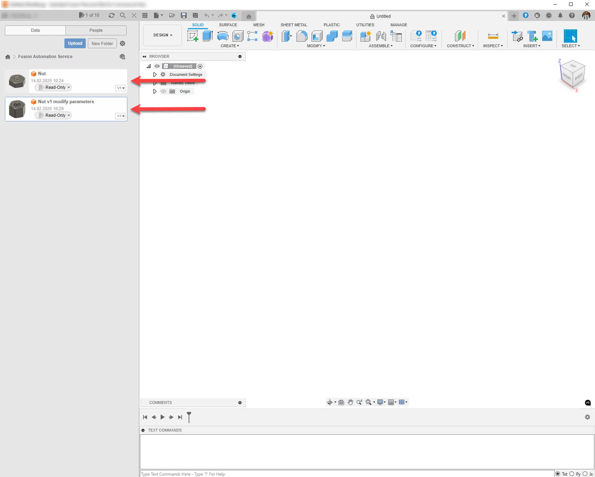
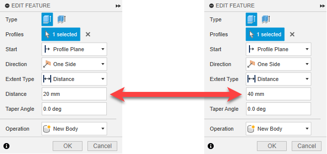

# Task 6 - Open Result in Fusion

Once the WorkItem has completed executing the Activity, Design Automation uploads the resulting file to Fusion Teams. You can use the Fusion desktop client on you local machine to check the result of the WorkItem.

## Open Result in Fusion

1. Start an instance of Fusion

2. Open the Fusion Teams Panel and locate the `Fusion Automation Service` project

    

3. Open the project. There should be two designs: `Nut` and `Nut v1 modify parameters`

    

4. Open both of them and check the change in the `Distance` of the Feature `Extrude 1`

    

[:rewind:](../readme.md "readme.md") [:arrow_backward:](task-5.md "Previous task")
