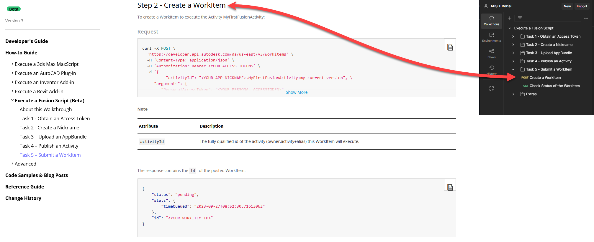

# Execute a Fusion Add-in

This folder contains a Postman Collection that contains the requests used in the [Execute a Fusion Add-in walkthrough](https://aps.autodesk.com/en/docs/design-automation/v3/tutorials/fusion/) on the APS developer portal. 

On the Postman sidebar, requests are stored in folders that have the same name as the corresponding task in the APS developer portal.

Individual requests in Postman have the same names as the corresponding step in the APS developer portal.

Instructions to run the Postman walkthrough are as below:

- [Before you begin](instructions/before_you_begin.md)
- [Task 2 - Obtain an Access Token](instructions/task-2.md)
- [Task 3 - Create a Nickname](instructions/task-3.md)
- [Task 4 - Upload an AppBundle to Design Automation](instructions/task-4.md)
- [Task 5 - Publish an Activity](instructions/task-5.md)
- [Task 6 - Prepare cloud storage](instructions/task-6.md)
- [Task 7 - Submit a WorkItem](instructions/task-7.md)

