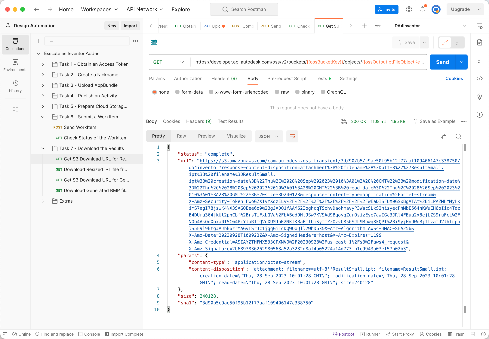
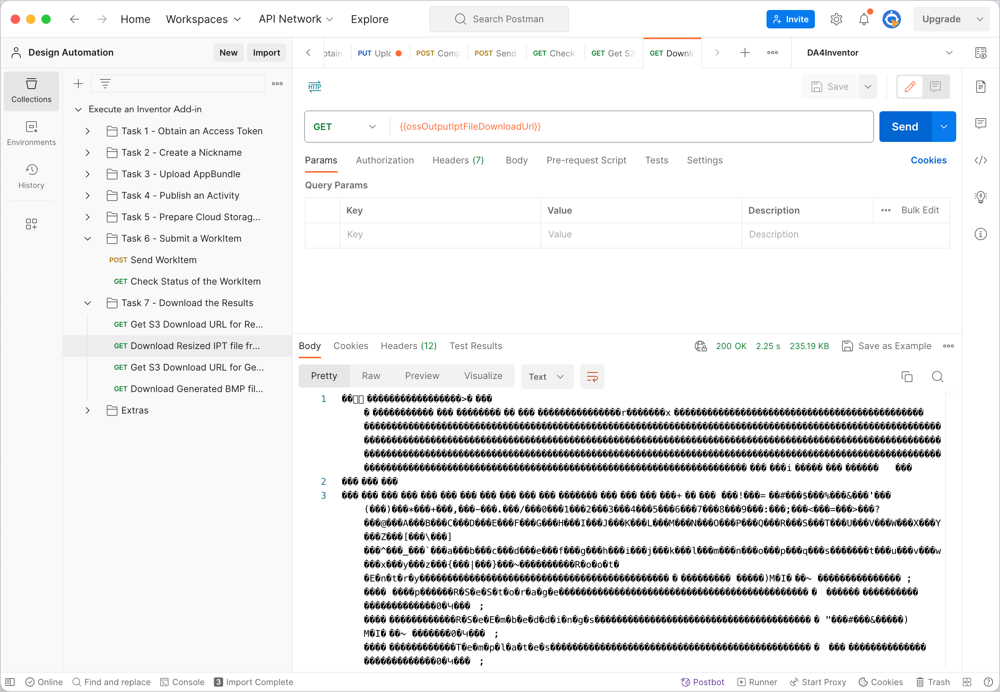
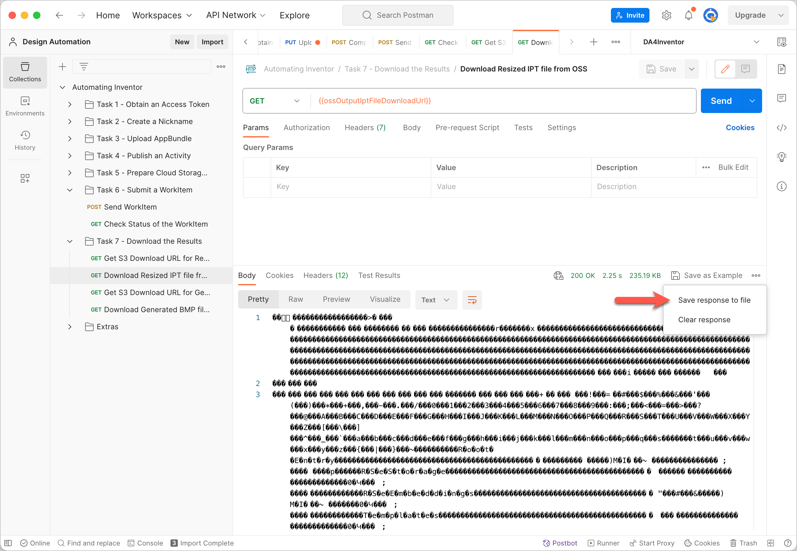
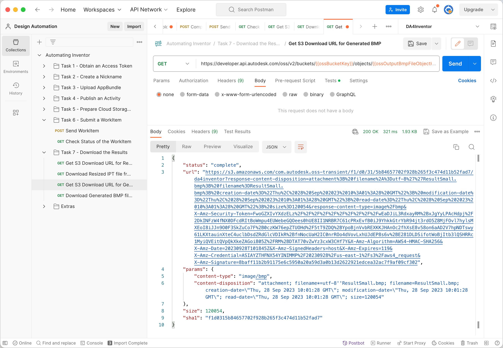
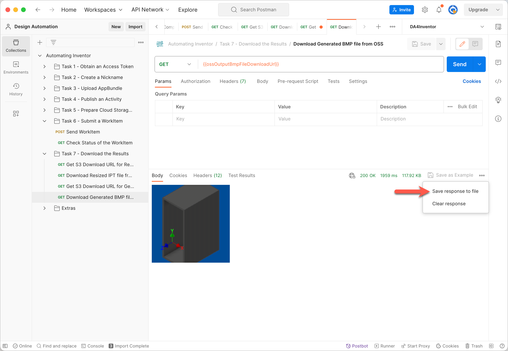

# Task 7 - Download the results

Once the WorkItem has completed executing the Activity, Design Automation uploads the resulting files to OSS. You use the Data Management API to download the files to your local machine.

## Get temporary download URL of the resized IPT file

1. On the Postman sidebar, click **Task 7 - Download the Result > GET Get S3 Download URL for Resized IPT file**. The request loads.

2. Click **Send**. You should see a screen similar to the following image.

    

## Download the resized IPT file from OSS

1. On the Postman sidebar, click **Task 7 - Download the Result > GET Download Resized IPT file from OSS**. The request loads.

2. Click **Send**. You should see a screen similar to the following image.

    

3. In the response area, click **Save response to file**. The output file downloads. Save the file as a *.bmp* file.

    

## Get temporary download URL of the generated BMP file

1. On the Postman sidebar, click **Task 7 - Download the Result > GET Get S3 Download URL for Generated BMP**. The request loads.

2. Click **Send**. You should see a screen similar to the following image.

    

## Download generated BMP file from OSS

1. On the Postman sidebar, click **Task 7 - Download the Result > GET Download Generated BMP**. The request loads.

    

2. Click **Send**. You should see a screen similar to the following image.

3. In the response area, click **Save Response > Save to a file**. The output file downloads. Save the file as a *.bmp* file.

    
