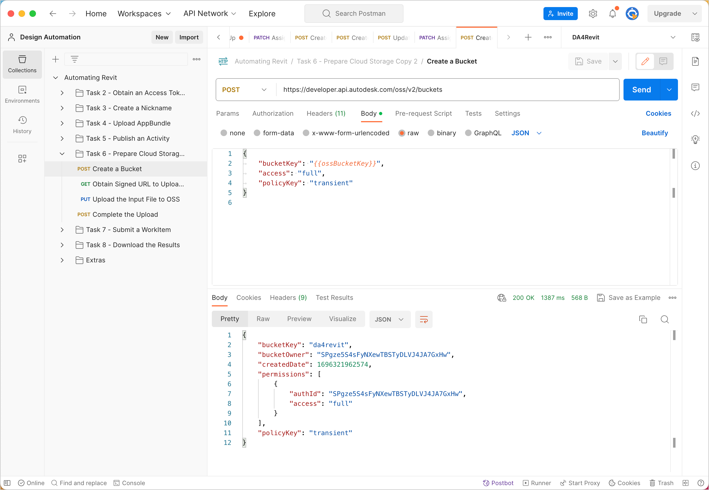
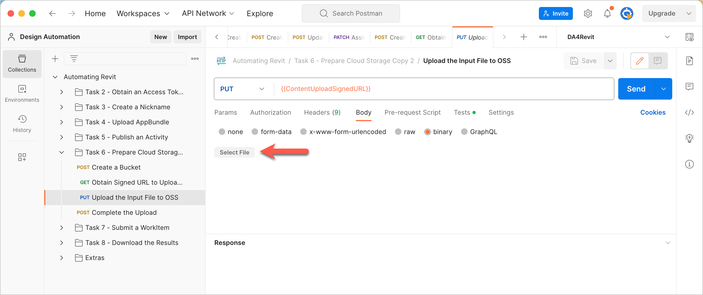
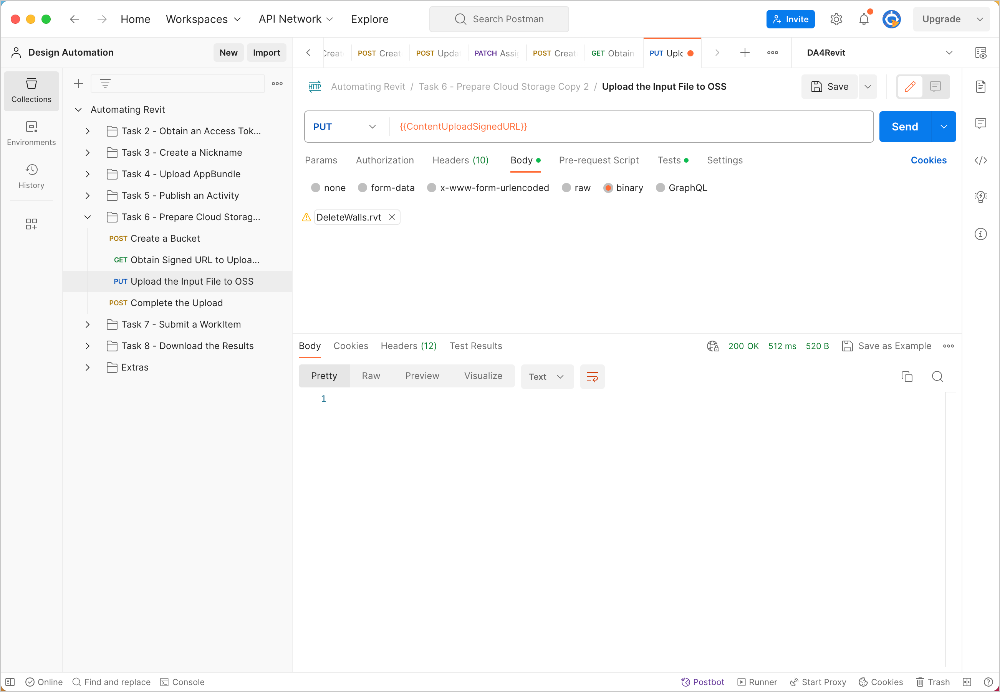
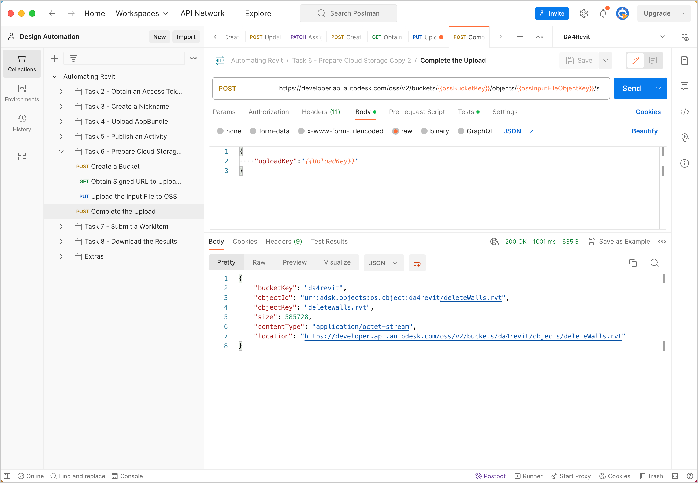

# Task 6 - Prepare cloud storage

The DeleteWalls add-in takes a Revit file as an input and produces another Revit file as output. In this task, we prepare the cloud storage to hold these files. While you can use any cloud storage service for this purpose, this tutorial uses the Object Storage Service (OSS) through the Data Management API.

There are three Postman Environment Variables you must specify for this task. They are
- `ossBucketKey` - The Bucket Key for the Bucket that holds your files in the cloud.
- `ossInputFileObjectKey` - The Object Key of the Revit file for use as input.
- `ossOutputFileObjectKey` - The Object Key of the placeholder for the output file that the add-in produces.

## Create a Bucket

1. Click the **Environment quick look** icon on the upper right corner of Postman.

2. In the **CURRENT VALUE** column, in the **ossBucketKey** row, specify a name the Bucket that stores your files.

    **Notes:**  
    - The Bucket name needs to be unique throughout the OSS service. if a Bucket with the name you specified already exists, the system will return a `409` conflict error in step 5. If you receive this error, change the value of this variable and try again.

    - The Bucket name must consist of only lower case characters, numbers 0-9, and the underscore (_) character.

3. Click the **Environment quick look** icon to hide the variables.

4. On the Postman sidebar, click **Task 6 - Prepare Cloud Storage > POST Create a Bucket**. The request loads.

5. Click **Send**. If the request is successful, you should see a screen similar to the following image.

    

## Obtain Signed URL to Upload the Input File

1. Download the input file, *DeleteWalls.rvt*  from the [*tutorial_data* folder of this repository](../tutorial_data).

2. Click the **Environment quick look** icon on the upper right corner of Postman.

3. In the **CURRENT VALUE** column, in the **ossInputFileObjectKey** row, specify an Object Key (a name to identify the input file, once it is uploaded to OSS).

4. Click the **Environment quick look** icon to hide the variables.

5. On the Postman sidebar, click **Task 6 - Prepare Cloud Storage > GET Obtain Signed URL to Upload the Input File**. The request loads.

6. Click **Send**. The signed URL is saved to a Collection Variable named `ContentUploadSignedURL`. The Upload Key is also saved to a variable named `UploadKey`. The Upload Key uniquely identifies the upload session. You use it later to complete the upload session.

   If your request is successful, you should see a screen similar to the one below:

    

## Upload input file to OSS

1. On the Postman sidebar, click **Task 6 - Prepare Cloud Storage > PUT Upload Input File to OSS**. The request loads.

2. Click the **Body** tab.

3. Click **Select File** and pick the file you downloaded earlier (*DeleteWalls.rvt*).

    

4. Click **Send**. If your request is successful, you should see a screen similar to the one below:

    

## Complete the upload

To make the uploaded file available for download, you must specifically instruct OSS that the upload process has been completed.

1. On the Postman sidebar, click **Task 6 - Prepare Cloud Storage > POST Complete the upload**. The request loads.

2. Click the **Body** tab and pay attention to how the Upload Key tells OSS what upload session to close.

3. Click **Send**. If your request is successful, you should see a screen similar to the one below:

   

## Define Object Keys for the output file that the add-in produces

The add-in deletes the walls in the input file and produces an *.rvt* file that contains all other objects. Use the Postman Environment Variable  `ossOutputFileObjectKey` to hold the Object Key of this *.rvt* file.

1. Click the **Environment quick look** icon on the upper right corner of Postman.

2. In the **CURRENT VALUE** column, in the **ossOutputFileObjectKey** row, specify an Object Key for the *.rvt* file that the add-in produces.

   **Tip:** You can use the file name of the *.rvt* file (*result.rvt*) as its Object Key.

3. Click the **Environment quick look** icon.

[:rewind:](../readme.md "readme.md") [:arrow_backward:](task-5.md "Previous task") [:arrow_forward:](task-7.md "Next task")
