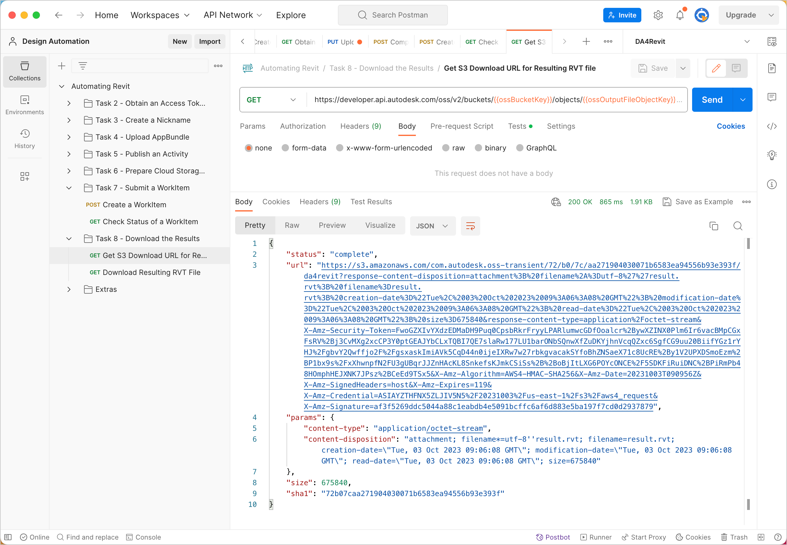
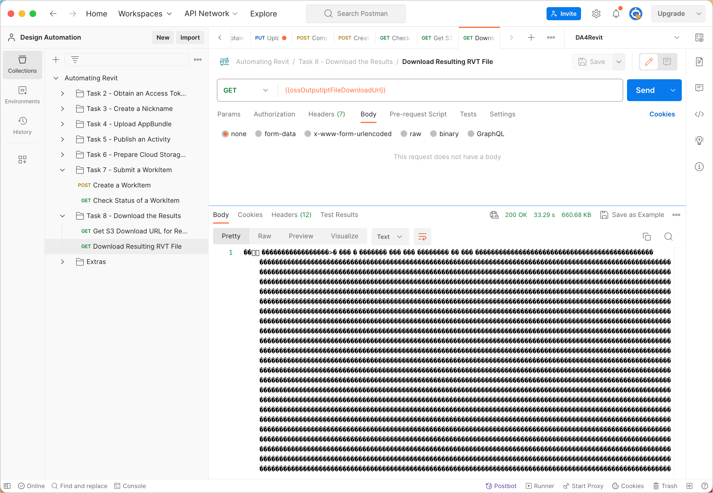
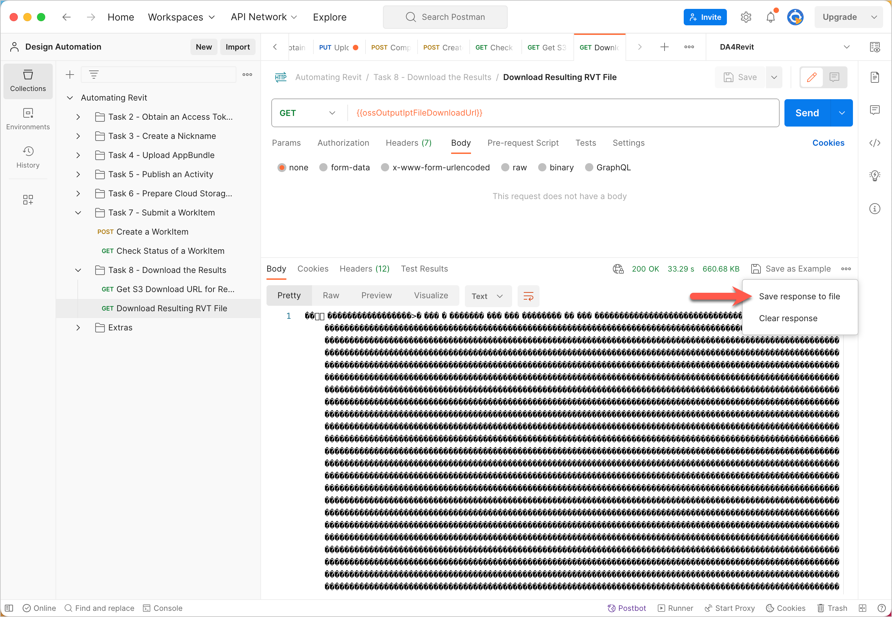

# Task 7 - Download the results

Once the WorkItem has completed executing the Activity, Design Automation uploads the resulting file to OSS. You use the Data Management API to download the file to your local machine.

## Get temporary download URL of the resulting RVT file

1. On the Postman sidebar, click **Task 7 - Download the Result > GET Get S3 Download URL for result**. The request loads.

2. Click **Send**. You should see a screen similar to the following image.

    

## Download the resulting RVT file

1. On the Postman sidebar, click **Task 7 - Download the Result > Download Resulting RVT File**. The request loads.

2. Click **Send**. You should see a screen similar to the following image.

    

3. In the response area, click **Save response to file**. The output file downloads. Save the file as a *.rvt* file.

    

[:rewind:](../readme.md "readme.md") [:arrow_backward:](task-7.md "Previous task")
