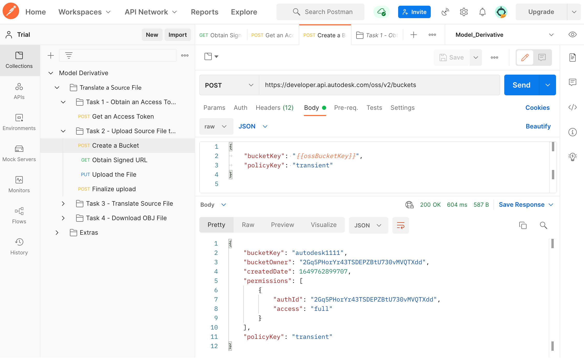
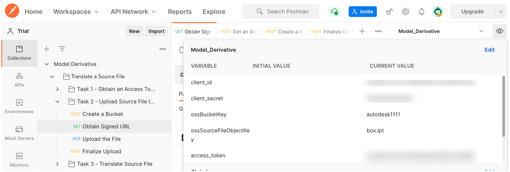
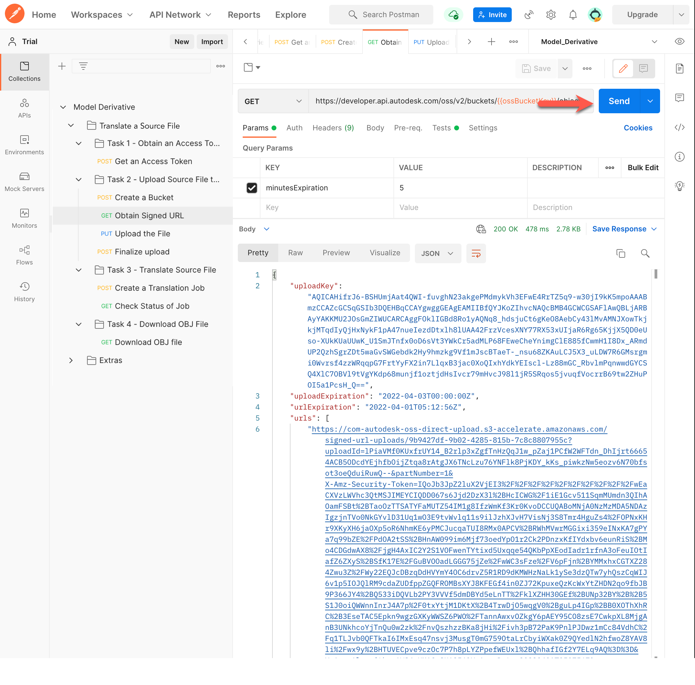
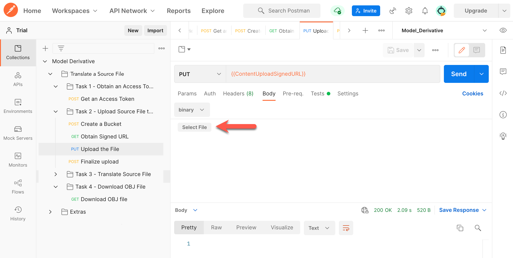
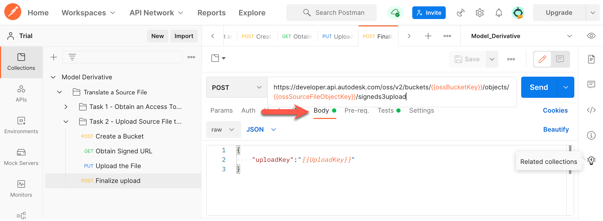
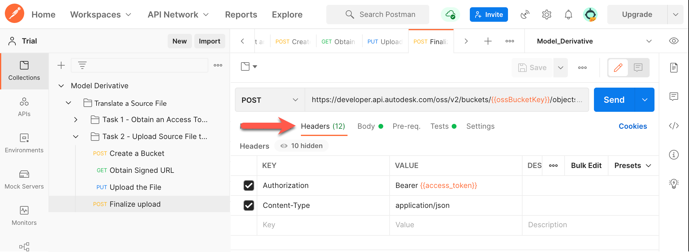
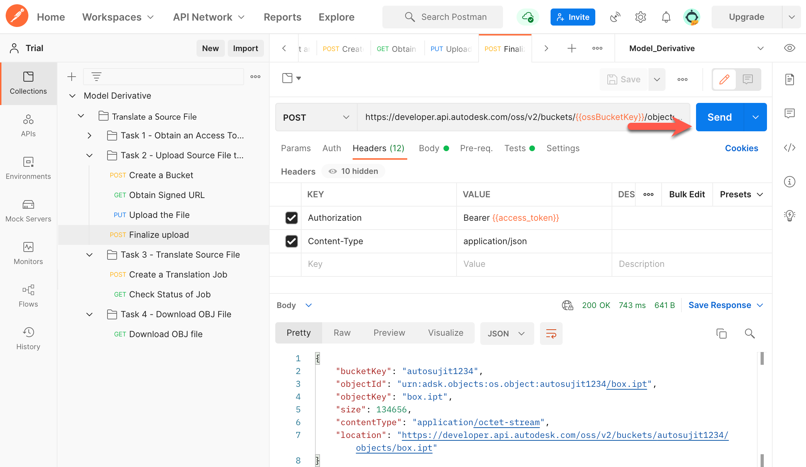

# Task 2 - Upload Source File to OSS

> **Important:** These instructions are specific to Postman V10. If you are using a newer version of Postman, you may notice slight differences in the interface or steps, but the basic procedure should remain similar.

The Object Storage Service (OSS) is a generic Cloud Storage Service that is part of the Data Management API. In this task, you will upload a model to OSS. While you can use any model, we recommend using the file *box.ipt*, which is available in the [*walkthrough_data*](../walkthrough_data) folder.

## Create a Bucket

In this walkthrough, you will use a Postman environment variable named `ossBucketKey` to hold the Object Key of the Bucket that contains your files in the cloud. If you already have a bucket (from a previous walkthrough), carry out step 1, and ignore the rest.

1. Specify a value for the Bucket Key in the Postman Environment Variable named `ossBucketKey`:

    a. Click the **Environment quick look** icon (the eye icon) on the upper right corner of Postman.

    b. In the **CURRENT VALUE** column, in the **ossBucketKey** row, enter a name for the Bucket that will store your files.

        **Notes:**  
        
        - The Bucket name must be unique across the OSS service. If a Bucket with the name you specified already exists, the system will return a `409` conflict error in step 5. If you receive this error, change the variable value and try again.

        - The Bucket name can only contain lowercase letters, numbers 0-9, and underscores (_).

    c. Click the **Environment quick look** icon to hide the variables.

2. In the Postman sidebar, click **Task 2 - Upload Source File to OSS > POST Create a Bucket**. The request loads.

3. Click the **Body** tab, and verify that the `bucketkey` attribute is set to the `ossBucketKey` variable.

4. Click **Send**. If the request is successful, you should see a screen similar to the following image.

   
    
## Obtain Signed URL

Before uploading a file to OSS, you must first obtain a signed upload URL for the file. To obtain a signed upload URL:

1. In the Postman sidebar, click **Task 2 - Upload Source File to OSS > GET Obtain Signed URL**. The request loads.

   Note the use of `ossBucketKey` and `ossSourceFileObjectKey` as URI parameters.

2. Click the **Environment quick look** button and set the Postman environment variable `ossSourceFileObjectKey` to `box.ipt`, which is the value you will use for the Object Key of the file to upload.

   

3. Click the **Params** tab, and note that the `minutesExpiration` query parameter is defined as 5 minutes. Change this value to 10.

   

4. Click **Send**. A script in the **Tests** tab updates the following Postman environment variables:

   | Variable Name              | Description                                                                                 |
   |----------------------------|---------------------------------------------------------------------------------------------|
   | UploadKey                  | The unique upload key assigned to the file you want to upload.                              |
   | ContentUploadSignedURL     | The signed upload URL you must use to upload the source file.                               |
   
   You should see a screen similar to the following image:
   
   
   
## Upload the file

Now that you have obtained a signed upload URL, you can go ahead and upload the file _box.ipt_ to OSS.

1. Download the file *box.ipt* from the [*walkthrough_data* folder of this walkthrough](../walkthrough_data).

2. In the Postman sidebar, click **Task 2 - Upload Source File to OSS > PUT Upload the File**. The request loads.

   Note the use of `ContentUploadSignedURL` as the URI.

3. Click the **Body** tab.

4. Click **Select File** and select the file *box.ipt*, which you downloaded in step 1.

   
   
5. Click **Send** to upload the file.

## Finalize Upload

The upload process is designed to let you split a file into multiple chunks and upload each chunk in parallel. Once all chunks are uploaded, you must finalize the upload so that OSS can recombine the file and make it available for download. Even though you uploaded the file in one go without splitting it into chunks, you still need to finalize the upload to make the file available for download.

1. In the Postman sidebar, click **Task 2 - Upload Source File to OSS > POST Finalize Upload**. The request loads.

   Note the use of `ossBucketkey` and `ossSourceFileObjectKey` as URI parameters.

2. Click the **Body** tab, and verify that the `uploadKey` attribute has been set to the variable `UploadKey`.

   

3. Click the **Headers** tab. Notice that the `Authorization` and `Content-Type` headers are already defined.

   

4. Click **Send** to finalize the upload. A script in the **Tests** tab updates the following Postman environment variables:

   | Variable Name              | Description                                                                                 |
   |----------------------------|---------------------------------------------------------------------------------------------|
   | t1_ossSourceFileObjectKey  | Object Key of the source file. Should be `box.ipt`.                                         |
   | t1_ossSourceFileURN        | Value of the `objectId` attribute in the JSON response. This is the URN of the source file. |
   | t1_ossEncodedSourceFileURN | The URN of the source file, converted to a Base64-encoded URN.                              |

    You should see a screen similar to the following image:

    

[:rewind:](../readme.md "readme.md") [:arrow_backward:](task-1.md "Previous task") [:arrow_forward:](task-3.md "Next task")
