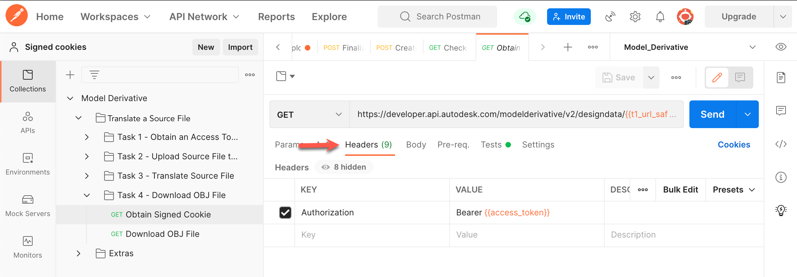
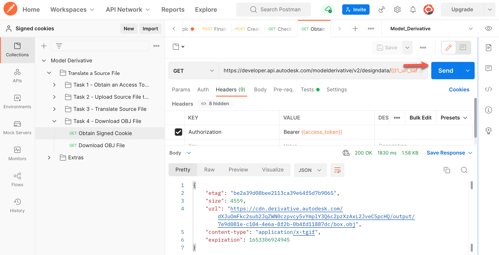
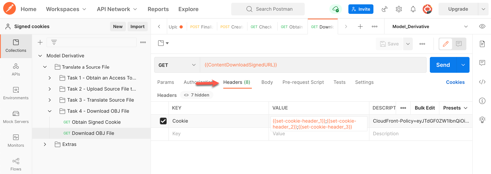
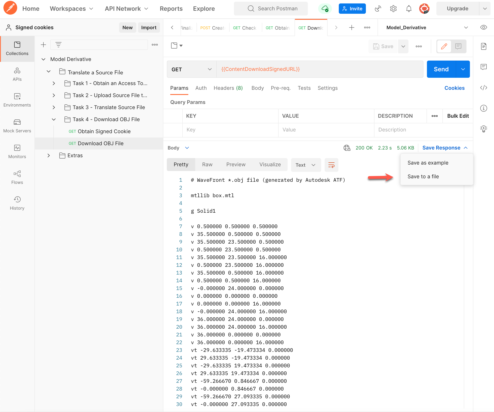

# Task 4 - Download the OBJ file

> **Important:** These instructions are specific to Postman V10. If you are using a newer version of Postman, you may notice slight differences in the interface or steps. However, the process should remain similar.

Before you download the OBJ file, make sure that the translation job is complete. In the previous task, you captured the URN of the generated OBJ file in a variable named `dv_urn_0`.

## Obtain Signed Cookie

To securely download the generated OBJ file, you must obtain a download link and a signed cookie. The link and cookie will be valid only for a limited amount of time. To request these:

1. In the Postman sidebar, click **Task 4 - Download OBJ File > GET Obtain Signed Cookie**. The request loads.

   Note the use of the Postman environment variables `t1_url_safe_urn_of_source` and `dv_urn_0` as URI parameters.

2. Click the **Headers** tab. Notice that the `Authorization` header is already defined.

    

3. Click **Send**. You should see a screen similar to the following image.

   Notice how the response body contains the download URL. A script in the **Tests** tab captures the download URL to the `ContentDownloadSignedURL` Postman environment variable.

    

4. Click on the Response **Headers** tab. Notice how the response contains three headers named `set-cookie`. A script in the **Tests** tab saves the values of these parameters to the `set-cookie-header_1`, `set-cookie-header_2`, and `set-cookie-header_3` environment variables.

    

## Download OBJ File

Now that you have obtained the download link and signed cookie, you can download the OBJ file. To download the OBJ file:

1. In the Postman sidebar, click **Task 4 - Download OBJ File > GET Download OBJ File**. The request loads.

   Note the use of the variable `ContentDownloadSignedURL` as the URI.

2. Click the **Headers** tab. Notice that the `Cookie` header is composed of `set-cookie-header_1`, `set-cookie-header_2`, and `set-cookie-header_3`.

    

3. Click **Send**. You should see a screen similar to the following image. In the response area, click **Save Response > Save to a file**. Save the file as *box.obj* when prompted.

    

Congratulations! You have completed this walkthrough.

To display the saved file:

- If you are using an Apple Macintosh, right-click *box.obj* in Finder and select **Quick Look** from the menu.
- If you are using Windows, right-click *box.obj* in Windows Explorer and select **Open with > 3D Viewer** from the menu.

[:rewind:](../readme.md "readme.md") [:arrow_backward:](task-3.md "Previous task")
