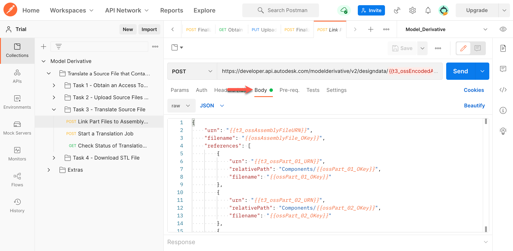
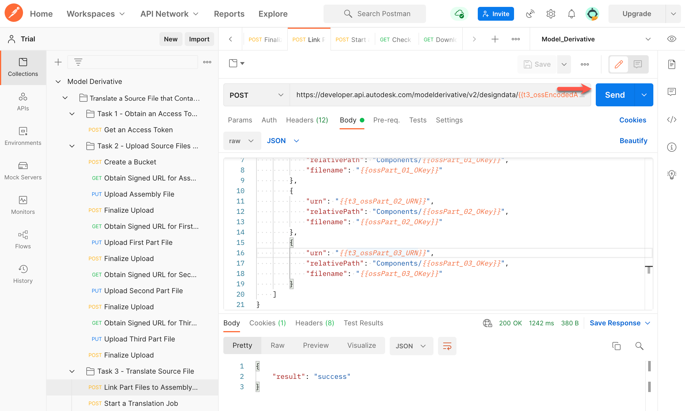
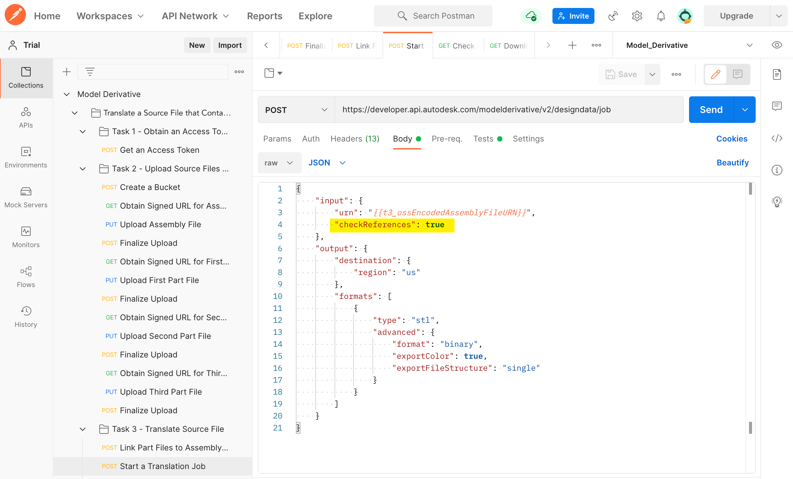
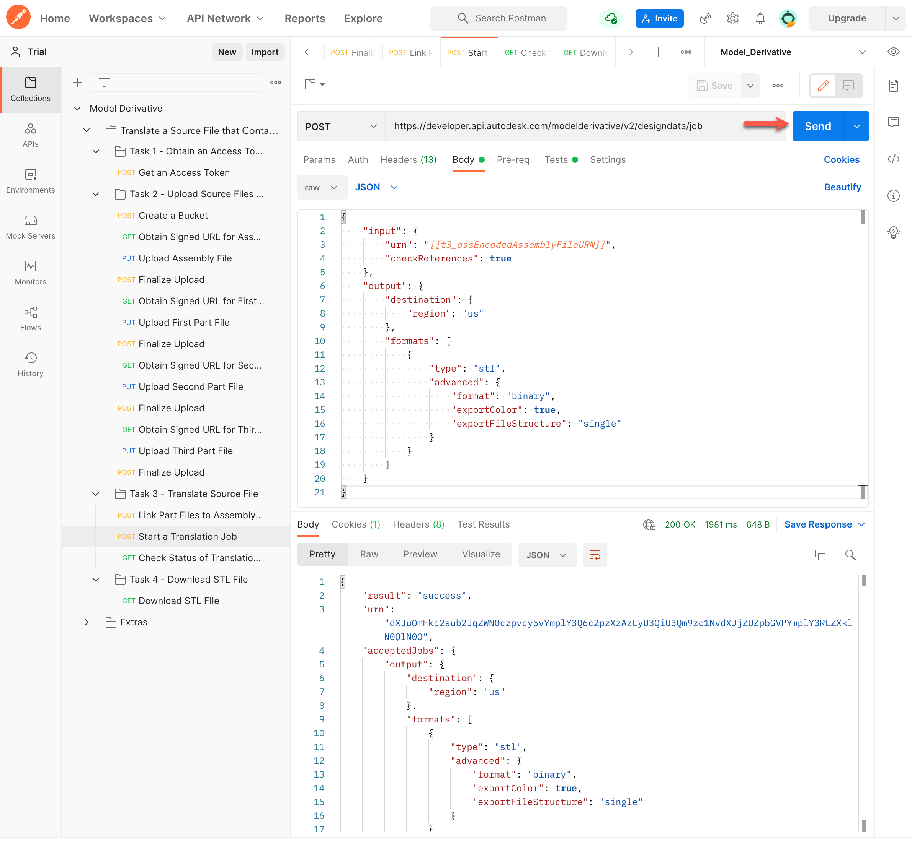
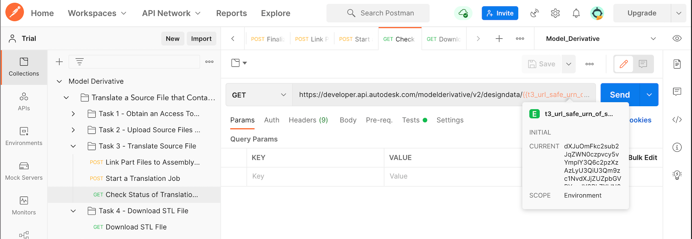

# Task 3 – Translate Source File

> **Important:** These instructions are specific to Postman V10. If you are using a newer version of Postman, you may notice slight differences in the interface or steps. However, the process should remain similar.

You can translate the source file to many different formats (see [Supported Translations](https://aps.autodesk.com/en/docs/model-derivative/v2/developers_guide/supported-translations/) for details). In this walkthrough, you will translate the source file to the STL format.

To translate a model, you must create a translation job. Before creating the translation job, you must link the main assembly file to its references (part files). This allows the Model Derivative service to fetch the referenced files from Object Storage Service (OSS) when the translation job is executed.

The translation job produces a manifest that lists all generated files. It also reports the progress of the translation job as a percentage while the translation job is still in progress.

## Link the assembly file to the referenced part files

The assembly file *scissors.iam* expects its part files to be located in a subfolder named *Components*. When linking the part files to the assembly file, use the ``relativePath`` attribute in the JSON payload to specify this folder structure.

1. In the Postman sidebar, click **Task 3 - Translate Source File > POST Link Part Files to Assembly File**. The request loads.

2. Click the **Body** tab.

   

   Notice how this request uses a mix of raw URNs and Base64-encoded URNs. The URI parameter uses a Base64-encoded URN, while the JSON payload uses the raw URN. Also, note the use of the `relativePath` attribute to specify the location of the referenced files (part files) relative to the source file (assembly file).

3. Click **Send**. If the request is successful you should see a screen similar to the following image.

   

## Create a translation job

1. In the Postman sidebar, click **Task 3 - Translate Source File > Start a Translation Job**. The request loads.

2. Click the **Body** tab and take note of the JSON payload.

    

    Notice the use of the `checkReferences` attribute to instruct APS that the source file contains references that must be downloaded at translation time.

3. Click **Send**. If the request is successful you should see a screen similar to the following image.

    

    Note the `urn` attribute in the JSON response. This is the URL-safe Base64 encoded URN of the source file. A script in the **Tests** tab, saves this value to a variable named `t3_url_safe_urn_of_source`.

## Check status of translation job

Translation jobs take time to complete. There are two ways to check if the translation job is done:

- Periodically check the status of the translation job.
- Set up a webhook to notify you when the job is done.

For this walkthrough, you will check the status of the translation job. For more information on webhooks, see the [documentation on Model Derivative webhook events](https://aps.autodesk.com/en/docs/webhooks/v1/reference/events/model_derivative_events).

1. In the Postman sidebar, click **Task 3 - Translate Source File > Check Status of Translation Job**. The request loads.

   

   Note the use of the URL-safe Base64 encoded URN of the source file as a URI parameter (the `t3_url_safe_urn_of_source` variable)

2. Click **Send**. You will see a screen similar to the following image.

   

   When a job is complete, the `progress` attribute becomes `complete`. Repeat this step until the job is complete.

   A script in the **Tests** tab, saves the URN of the STL file to a variable named `dv_urn_0`.

[:rewind:](../readme.md "readme.md") [:arrow_backward:](task-2.md "Previous task") [:arrow_forward:](task-4.md "Next task")
