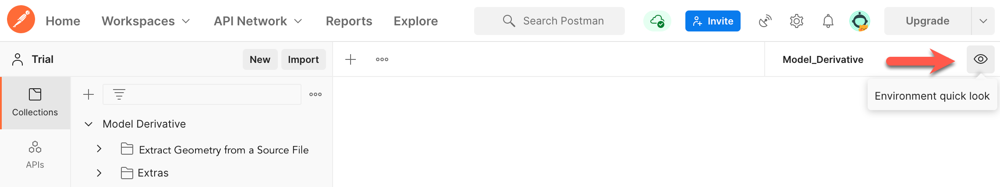
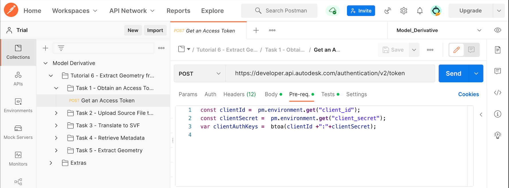

# Task 1 - Obtain an Access Token

## Create an App

1. Follow the instructions on the tutorial [Create an App](https://aps.autodesk.com/en/docs/oauth/v1/tutorials/create-app/).
 When specifying details of the app,  select "Model Derivative API" and "Data Management API".

2. Copy the *Client ID* and *Client Secret* of the app you created. You need these parameters in the next step.

## Save Client ID and Client Secret to Postman Environment Variables

In the Model_Derivative environment that you selected earlier, there are two Postman Environment Variables named `client_id` and `client_secret`. By setting these variables, you don't need to specify their values when you send HTTP requests to APS.

To set the environment variables:

1. Click the **Environment quick look** icon on the upper right corner of Postman.

   

2. Click in the **CURRENT VALUE** column on the **client_id** row. The Edit icon displays.

    

3. Click the Edit icon, and enter the *Client ID* you jotted down earlier.

4. Similarly, enter the *Client Secret* you jotted down earlier, in the **CURRENT VALUE** column on the **client_secret** row.

5. Click the **Environment quick look** icon again to close it.

## Get an Access Token

Before you request an access token, you must encode your Client ID and Client Secret to ensure the integrity of the data you send. To do this, first, concatenate your Client ID with your Client Secret using the colon character as a separator. After that, you must convert the concatenated string to a Base64 encoded string. A pre-request script in Postman handles this conversion for you when it sends the next request to APS.

To request an Access Token from APS:

1. In the Postman sidebar, click **Task 1 - Obtain an Access Token > POST Get an Access Token**. The request loads.

2. Click the **Pre-request Script** tab. Examine the script that encrypts your Client ID and Client Secret.

   

4. Click **Send**. Postman sends the HTTP request to APS. If the request authenticates successfully, the server returns `200 OK`. The response screen is similar to the following:

    

Postman saves the Access Token in the Postman environment variable `access_token`. Postman will pick up the Access Token from this variable for all subsequent requests. The token remains valid for one hour.  If the token expires, you must obtain a fresh token by sending an `authenticate` request to APS once again.

[:rewind:](../readme.md "readme.md") [:arrow_backward:](before_you_begin.md "Previous task") [:arrow_forward:](task-2.md "Next task")
