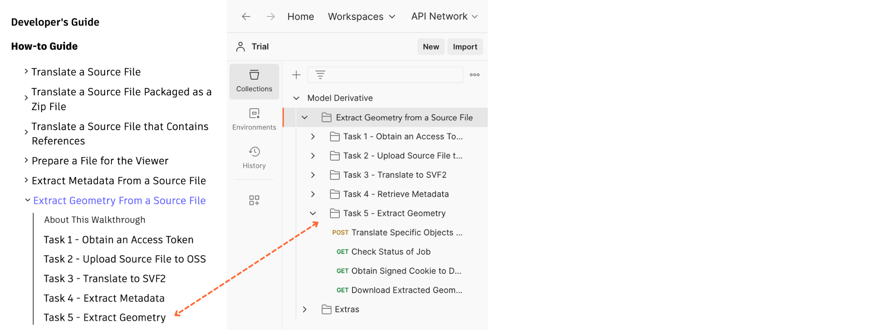
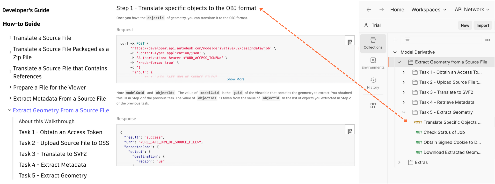

# Extract Geometry from a Source File

This folder contains a Postman Collection with the requests used in the [Extract Geometry from a Source File walkthrough](https://aps.autodesk.com/en/docs/model-derivative/v2/tutorials/xtract-geometry-from-source-file/).

In the Postman sidebar, requests are stored in folders that have the same name as the corresponding task in the walkthrough on the APS developer portal.

Individual requests in Postman have been named such that the corresponding step in the walkthrough (on the APS developer portal) can be figured out easily.

Instructions to run the Postman collection are as follows:

- [Before you begin](instructions/before_you_begin.md)
- [Task 1 - Obtain an Access Token](instructions/task-1.md)
- [Task 2 - Upload Source File to OSS](instructions/task-2.md)
- [Task 3 – Translate to SVF2](instructions/task-3.md)
- [Task 4 - Extract Metadata](instructions/task-4.md)
- [Task 5 - Extract Geometry](instructions/task-5.md)
